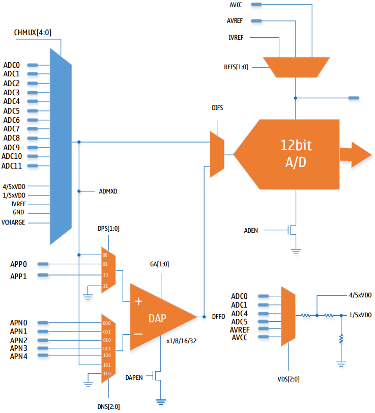
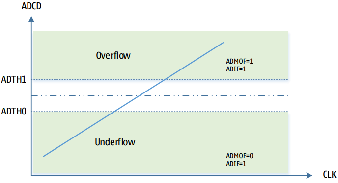

# Аналого-цифровой преобразователь (АЦП)

- 12-битное разрешение, DNL = ±1 LSB, INL = ±1.5 LSB
- Частота дискретизации до 500 KSPS при максимальном разрешении
- 12 мультиплексированных каналов однополярного входа
- Каналы дифференциального усилителя с программируемым коэффициентом усиления для нескольких входов
- Диапазон входного напряжения: 0 – VCC
- Внутренние опорные напряжения: 1.024 В / 2.048 В / 4.096 В
- Поддержка AVCC и внешнего опорного напряжения
- Внутренние делители напряжения: 1/5 и 4/5 для нескольких входов
- Поддержка калибровки смещения в положительном и отрицательном направлениях
- Режим автоматического запуска преобразования по источнику прерывания
- Поддержка автоматического мониторинга каналов с обнаружением верхнего/нижнего переполнения
- Поддержка выбираемого выравнивания результата преобразования
- Запрос прерывания по завершении преобразования

## Схема АЦП

Аналого-цифровой преобразователь представляет собой 12-битный АЦП последовательного приближения. АЦП подключён к 17-канальному аналоговому мультиплексору, что позволяет выполнять выборку и преобразование сигналов с 12 аналоговых входов внешних портов микроконтроллера, а также с 5 каналов внутренних источников напряжения. АЦП содержит встроенный дифференциальный операционный усилитель с программируемым коэффициентом усиления x1/x8/x16/x32, вход которого может быть подключён либо к внешним портам, либо к выходу мультиплексора АЦП. Выход дифференциального усилителя может использоваться в качестве аналогового входа АЦП.

Внутренние аналоговые источники входа АЦП включают: многоходовой входной делитель внутри АЦП; внутренний источник опорного напряжения; внутреннюю аналоговую опорную землю, а также аналоговый выход модуля сенсорных кнопок. Многоходовой входной делитель напряжения одновременно выдаёт два напряжения: 4/5 и 1/5. На вход делителя можно подавать либо уровень с внешнего порта, либо напряжение системного питания.

АЦП поддерживает калибровку смещения. Процесс калибровки смещения выполняется под управлением программного обеспечения. Калибровка смещения включает в себя калибровочные величины как для прямого, так и для обратного направлений. После включения компенсации смещения контроллер АЦП будет автоматически использовать оба калибровочных значения для коррекции результатов выборки АЦП. Метод калибровки смещения описан в соответствующем разделе данной главы.

## Работа АЦП

АЦП преобразует входное аналоговое напряжение в 12-битное цифровое значение методом последовательного приближения. Минимальное значение (0) соответствует GND, а максимальное значение соответствует опорному напряжению минус 1 LSB. Источником опорного напряжения может быть: напряжение питания АЦП (AVCC), внешнее опорное напряжение (AVREF) или внутренние опорные напряжения 1.024 В / 2.048 В / 4.096 В. Выбор осуществляется записью в биты REFS регистра ADMUX.

Канал аналогового входа выбирается записью в биты CHMUX регистра ADMUX. Любой вывод аналогового входа АЦП, вывод внешнего опорного напряжения, а также внутренние источники опорного напряжения могут использоваться как однополярный вход АЦП. Установка бита DIFS в регистре ADTMR переключает входной канал АЦП на внутренний дифференциальный усилитель. Источники входного сигнала и коэффициент усиления дифференциального усилителя настраиваются через регистр DAPCR.

Для запуска АЦП необходимо установить бит ADEN в регистре ADCSRA. Когда бит ADEN сброшен, АЦП не потребляет энергию, поэтому рекомендуется отключать АЦП перед переходом в режим сна.

Результат преобразования АЦП имеет разрядность 12 бит и сохраняется в регистрах данных АЦП: ADCH и ADCL. По умолчанию результат выравнивается по правому краю, но установка бита ADLAR в регистре ADMUX переключает на выравнивание по левому краю.

Если выбран режим выравнивания по левому краю и требуется точность не выше 8 бит, достаточно считать только регистр ADCH. В противном случае сначала необходимо считать ADCL, а затем ADCH — это гарантирует, что содержимое регистров данных относится к результату одного преобразования. После чтения ADCL регистры данных ADCL и ADCH блокируются, после чтения ADCH новые результаты преобразования могут быть загружены в ADCL и ADCH.

По завершении преобразования АЦП может генерировать прерывание. Прерывание возникнет, даже если завершение преобразования произойдёт между чтением ADCL и ADCH.

## Запуск преобразования

Запись «1» в бит запуска преобразования ADSC запускает однократное преобразование. Во время преобразования этот бит остаётся высоким и сбрасывается аппаратно после завершения преобразования. Если во время преобразования изменить канал, АЦП сначала завершит текущее преобразование, а затем изменит канал.

АЦП поддерживает различные источники запуска преобразования. Установка бита автоматического запуска ADATE в регистре ADCSRA разрешает автоматический запуск. Биты выбора источника запуска ADTS в регистре ADCSRB позволяют выбрать источник запуска. При возникновении возрастающего фронта на выбранном сигнале запуска предделитель АЦП сбрасывается и начинается преобразование. Это обеспечивает метод запуска преобразования через фиксированные интервалы времени. После завершения преобразования новое преобразование не запускается, даже если сигнал запуска всё ещё присутствует. Если во время преобразования на сигнале запуска возникает ещё один возрастающий фронт, он игнорируется. Флаг прерывания будет установлен, даже если соответствующее прерывание запрещено или глобальные прерывания отключены. Таким образом, преобразование может быть запущено без генерации прерывания. Однако для запуска нового преобразования при следующем событии прерывания необходимо сбросить флаг прерывания.

Использование флага прерывания АЦП в качестве источника запуска позволяет начать следующее преобразование сразу после завершения текущего. Затем АЦП переходит в режим непрерывного преобразования, постоянно выполняя выборку и обновляя регистры данных АЦП. Первое преобразование в этом режиме запускается записью «1» в бит ADSC регистра ADCSRA. В этом режиме последующие преобразования АЦП не зависят от того, установлен ли флаг прерывания АЦП ADIF.

Если автоматический запуск разрешён, установка бита ADSC в регистре ADCSRA запускает однократное преобразование. Бит ADSC также можно использовать для контроля выполнения преобразования. Независимо от того, как было запущено преобразование, бит ADSC остаётся равным «1» на протяжении всего процесса преобразования.

## Предделитель и временные диаграммы преобразования АЦП

В стандартных условиях схема последовательного приближения требует тактовую частоту на входе от 300 кГц до 3 МГц для достижения максимальной точности. Если требуемая точность преобразования ниже 12 бит, частота входного тактового сигнала может превышать 3 МГц для достижения более высокой частоты дискретизации.

Модуль АЦП включает предделитель, который формирует приемлемую тактовую частоту АЦП из системной тактовой частоты. Предделитель настраивается битами ADPS регистра ADCSRA. Установка бита ADEN в регистре ADCSRA включает АЦП, и предделитель начинает счёт. Пока бит ADEN установлен в «1», предделитель продолжает счёт до тех пор, пока ADEN не будет сброшен.

После установки бита ADSC в регистре ADCSRA однополярное преобразование начинается по возрастающему фронту следующего тактового импульса АЦП. Нормальное преобразование требует 15 тактов АЦП. После включения АЦП (установка бита ADEN в регистре ADCSRA) для инициализации аналоговой схемы требуется 50 тактов входного тактового сигнала АЦП, и только после этого первое преобразование может быть выполнено корректно.

В процессе преобразования АЦП выборка удерживается и начинается через 1.5 такта входного тактового сигнала АЦП после запуска, а результат первого преобразования АЦП выводится через 14.5 тактов входного тактового сигнала АЦП после запуска. После завершения преобразования результат АЦП загружается в регистр данных АЦП, и устанавливается флаг ADIF. Бит ADSC одновременно сбрасывается. После этого программное обеспечение может снова установить флаг ADSC или использовать автоматический запуск для начала нового преобразования.

## Выбор канала и опорное напряжение

Биты MUX и REFS в регистре ADMUX реализованы с двойной буферизацией через временный регистр. ЦПУ имеет произвольный доступ к временному регистру. Конфигурация канала и источника опорного напряжения может быть изменена в любой момент до запуска преобразования. После запуска преобразования изменение конфигурации канала и источника опорного напряжения не допускается, чтобы обеспечить АЦП достаточное время для выборки. Конфигурация канала и источника опорного напряжения обновляется только после завершения преобразования (когда установлен флаг ADIF в регистре ADCSRA). Момент начала преобразования — это возрастающий фронт следующего тактового импульса АЦП после установки бита ADSC. Поэтому рекомендуется не изменять ADMUX для выбора нового канала и источника опорного напряжения в течение одного такта входного тактового сигнала АЦП после сброса ADSC.

При использовании автоматического запуска момент возникновения события запуска непредсказуем. При обновлении регистра ADMUX необходимо соблюдать особую осторожность, чтобы контролировать влияние новых настроек на преобразование. Если установлены оба бита ADATE и ADEN, событие прерывания может произойти в любой момент, автоматически запуская преобразование АЦП. Если в это время изменить содержимое регистра ADMUX, пользователь не сможет определить, основано ли следующее преобразование на старой или новой конфигурации. Рекомендуется обновлять ADMUX в следующих безопасных случаях:

1. Бит **ADATE** или **ADEN** равен «0»;
2. Во время преобразования, но не менее чем через один такт входного тактового сигнала АЦП после возникновения события запуска;
3. После завершения преобразования, но до сброса флага прерывания источника запуска.

Если ADMUX обновляется в любой из вышеуказанных ситуаций, новая конфигурация вступит в силу перед следующим преобразованием. При выборе входного канала АЦП необходимо сначала выбрать канал до запуска преобразования. Новый аналоговый входной канал может быть выбран через один такт АЦП после установки ADSC, но самый простой способ — изменять канал после завершения преобразования.

Опорное напряжение АЦП Vref определяет диапазон преобразования АЦП. Если уровень однополярного канала превышает Vref, результат преобразования будет близок к максимальному значению 0xFFF. Vref может быть: AVCC, напряжение на внешнем выводе AREF или внутренний источник опорного напряжения.

**Замечания по использованию внутренних опорных источников (1.024 В / 2.048 В / 4.096 В):**

После включения питания внутренний опорный источник по умолчанию откалиброван на 1.024 В. Если пользователь использует внутренний опорный источник 1.024 В, он может использовать его напрямую без дополнительных действий. Однако если необходимо использовать внутреннее опорное напряжение 2.048 В или 4.096 В, необходимо самостоятельно обновить калибровочные значения внутреннего источника. Калибровочные значения для 2.048 В / 4.096 В загружаются после включения питания в регистры VCAL2 (0xCE) и VCAL3 (0xCC). При инициализации программы необходимо считать значения из VCAL2/3 и записать их в регистр VCAL (0xCB) — это завершит калибровку.

## Автоматический мониторинг каналов

Режим автоматического мониторинга каналов предназначен для наблюдения за изменением напряжения на выбранном входном канале АЦП в реальном времени. Программное обеспечение включает функцию автоматического мониторинга каналов установкой бита AMEN в регистре ADCSRC. АЦП автоматически преобразует напряжение выбранного канала, и когда результат преобразования выходит за пределы заданного порогового диапазона, устанавливается флаг прерывания АЦП (ADIF), и автоматический мониторинг останавливается. Программное обеспечение может реагировать на событие переполнения с помощью прерывания или опроса. Бит AMOF в регистре ADMSC указывает тип события переполнения. Флаг ADIF автоматически сбрасывается аппаратно при обработке прерывания, в режиме опроса он может быть сброшен программно записью 1. Режим автоматического мониторинга может быть повторно включён только после сброса ADIF и установки бита AMEN в регистре ADCSRC.

Для устранения нестабильности однократного результата преобразования АЦП автоматический мониторинг поддерживает настраиваемую цифровую фильтрацию. Цифровая фильтрация проверяет последовательные результаты преобразования: событие переполнения инициируется только в том случае, если в течение заданного количества последовательных преобразований получается согласованный результат. Количество последовательных преобразований задаётся битами AMFC[3:0] в регистре ADMSC.

Функция автоматического мониторинга каналов управляется битом AMEN в регистре ADCSRC. Регистр ADT0 используется для установки порога нижнего переполнения, регистр ADT1 — для установки порога верхнего переполнения. ADT0 и ADT1 являются 16-битными регистрами. После установки бита AMEN программным обеспечением текущее преобразование АЦП немедленно останавливается, состояние управления АЦП сбрасывается, после чего АЦП переходит в режим автоматического преобразования.

Программное обеспечение может в любой момент отключить режим автоматического мониторинга, сбросив бит AMEN в регистре ADCSRC.

## Делитель напряжения с несколькими входами (VDS)

АЦП содержит внутренний модуль делителя напряжения с несколькими входами. Источник входного напряжения для делителя может быть выбран из внешних входных каналов АЦП (ADC0/1/4/5), внешнего опорного напряжения AVREF или аналогового напряжения питания. Модуль делителя одновременно выдаёт два напряжения: 4/5 и 1/5, которые поступают соответственно на внутренние каналы 12 и 13 АЦП. Напряжение 4/5 в основном используется для калибровки смещения АЦП; напряжение 1/5, помимо использования во внутренней калибровке смещения, часто применяется для измерения напряжения питания и в подобных приложениях. Функции делителя напряжения в основном управляются регистром ADCSRD.

## Калибровка смещения АЦП

Из-за отклонений производственного процесса и особенностей схемотехники в компараторе АЦП может возникать погрешность смещения разной степени. Поэтому компенсация напряжения смещения критически важна для получения высокоточных результатов преобразования АЦП.

АЦП в чипах LGT8FX8P поддерживает интерфейсы для измерения напряжения смещения, что позволяет выполнять измерение и калибровку смещения программными средствами.

### Принцип калибровки смещения

Калибровка смещения в основном осуществляется путём изменения полярности входа внутреннего компаратора и измерения результатов преобразования АЦП в прямом и обратном направлениях. Поскольку напряжение смещения в прямом и обратном направлениях также проявляется как две полярности, промежуточное значение погрешности смещения может быть получено вычитанием двух результатов преобразования. В обычном режиме результат преобразования корректируется в соответствии с этим напряжением смещения.

### Процедура калибровки смещения

1. Настройте модуль VDS, выбрав в качестве источника входа VDS аналоговое питание (AVCC).
2. Выберите в качестве опорного напряжения АЦП аналоговое питание (AVCC).
3. Установите `ADCSRC[SPN] = 0`, считайте канал 4/5 VDO, запишите значение преобразования как `PVAL`.
4. Установите `ADCSRC[SPN] = 1`, считайте канал 4/5 VDO, запишите значение преобразования как `NVAL`.
5. Вычислите `(NVAL – PVAL) >> 1` и сохраните результат в регистр `OFR0`.
6. Установите `ADCSRC[SPN] = 1`, считайте канал 1/5 VDO, запишите результат преобразования как `NVAL`.
7. Установите `ADCSRC[SPN] = 0`, считайте канал 1/5 VDO, запишите результат преобразования как `PVAL`.
8. Вычислите `(NVAL – PVAL) >> 1` и сохраните результат в регистр `OFR1`.
9. Установите `ADCSRC[OFEN] = 1`, чтобы включить функцию компенсации смещения.

**Примечание:** поскольку погрешность смещения может иметь положительное или отрицательное направление, все вышеуказанные данные и операции должны быть знаковыми.

Поскольку в процессе калибровки смещения требуется изменять конфигурацию АЦП, рекомендуется выполнять калибровку смещения до настройки параметров нормального использования. Для повышения точности калибровки рекомендуется выполнять многократную фильтрацию при считывании канала АЦП.

После настройки `OFR0/OFR1` и включения автоматической компенсации смещения битом `OFEN` управление АЦП будет автоматически использовать `OFR0/OFR1` для компенсации при последующих обычных преобразованиях.

### Динамическая калибровка АЦП

Описанный выше метод калибровки смещения основан на измерениях в определённой тестовой среде и с определённым тестовым входным сигналом. При изменении системного окружения смещение АЦП также меняется. Поэтому возможность выполнения калибровки в реальном времени крайне важна для преодоления различий в производительности устройства, вызванных изменениями рабочей среды, и повышения точности измерений АЦП.

Здесь предлагается алгоритм, основанный на принципе калибровки смещения, который позволяет динамически компенсировать погрешность смещения, вызванную изменениями рабочей среды, и получать стабильные и точные результаты измерений.

Этот метод не требует вычисления напряжения смещения и не требует включения компенсации смещения (`OFEN`). Алгоритму нужно только управлять полярностью преобразования АЦП с помощью `SPN`, выполняя два измерения при разных значениях `SPN`. Поскольку погрешность смещения в двух результатах проявляется с разными знаками, её можно просто устранить, усреднив сумму двух измерений.

Предположим, что при преобразовании АЦП вносимая погрешность смещения равна `VOFS`. Тогда два последовательных преобразования АЦП с управлением `SPN` дадут следующие результаты:

- При `SPN = 1`: `VADC1 = VREL + VOFS1`
- При `SPN = 0`: `VADC0 = VREL – VOFS0`

Суммируя два измерения, можно устранить влияние `VOFS` на фактический входной сигнал `VREL`. Из-за характеристик согласования схемы `VOFS1` и `VOFS0` могут не совпадать полностью, но в целом эффект компенсации погрешности смещения всё равно достигается.

### Процедура алгоритма динамической компенсации смещения

1. Инициализируйте параметры преобразования АЦП в соответствии с требованиями приложения.
2. Установите `SPN = 1`, запустите выборку АЦП, запишите результат как `VADC1`.
3. Установите `SPN = 0`, запустите выборку АЦП, запишите результат как `VADC2`.
4. Вычислите `(VADC1 + VADC2) >> 1` — это и будет результат преобразования АЦП.

На практике этот алгоритм можно комбинировать с усреднением выборок для достижения ещё более идеальных результатов.

## Описание регистров

### Список регистров АЦП

| Регистр | Адрес | Значение по умолчанию | Описание |
|---------|-------|----------------------|----------|
| ADCL    | 0x78  | 0x00 | Регистр младшего байта данных АЦП |
| ADCH    | 0x79  | 0x00 | Регистр старшего байта данных АЦП |
| ADCSRA  | 0x7A  | 0x00 | Регистр управления и состояния АЦП A |
| ADCSRB  | 0x7B  | 0x00 | Регистр управления и состояния АЦП B |
| ADMUX   | 0x7C  | 0x00 | Регистр управления мультиплексором АЦП |
| ADCSRC  | 0x7D  | 0x01 | Регистр управления и состояния АЦП C |
| DIDR0   | 0x7E  | 0x00 | Регистр запрета цифрового входа 0 |
| DIDR1   | 0x7F  | 0x00 | Регистр запрета цифрового входа 1 |
| DAPCR   | 0xDC  | 0x00 | Регистр управления дифференциальным усилителем |
| OFR0    | 0xA3  | 0x00 | Регистр компенсации смещения 0 |
| OFR1    | 0xA4  | 0x00 | Регистр компенсации смещения 1 |
| ADT0L   | 0xA5  | 0x00 | Младшие 8 бит порога нижнего переполнения автоматического мониторинга |
| ADT0H   | 0xA6  | 0x00 | Старшие 8 бит порога нижнего переполнения автоматического мониторинга |
| ADT1L   | 0xAA  | 0x00 | Младшие 8 бит порога верхнего переполнения автоматического мониторинга |
| ADT1H   | 0xAB  | 0x00 | Старшие 8 бит порога верхнего переполнения автоматического мониторинга |
| ADMSC   | 0xAC  | 0x01 | Регистр состояния и управления автоматическим мониторингом |
| ADCSRD  | 0xAD  | 0x00 | Регистр управления и состояния АЦП D |
| VCAL    | 0xC8  | 0x00 | Регистр калибровки внутреннего опорного источника |
| VCAL1   | 0xCD  | 0x00 | Регистр калибровки внутреннего опорного источника 1.024 В |
| VCAL2   | 0xCE  | 0x00 | Регистр калибровки внутреннего опорного источника 2.048 В |
| VCAL3   | 0xCC   | 0x00 | Регистр калибровки внутреннего опорного источника 4.096 В |

### ADCL – Регистр младшего байта данных АЦП

| Адрес: 0x78 | Значение по умолчанию: 0x00 |
|-|-|

| Бит | 7 | 6 | 5 | 4 | 3 | 2 | 1 | 0 |
|-----|---|---|---|---|---|---|---|---|
| ADC[7:0] | ADC7 | ADC6 | ADC5 | ADC4 | ADC3 | ADC2 | ADC1 | ADC0 |
| ADC[3:0] | ADC3 | ADC2 | ADC1 | ADC0 | - | - | - | - |
| Доступ | R/W | R/W | R/W | R/W | R/W | R/W | R/W | R/W |
| Начальное значение | 0 | 0 | 0 | 0 | 0 | 0 | 0 | 0 |

#### Описание битов

| Бит | Имя | Описание |
|-----|-----|----------|
| 7:0 | ADC[7:0] ADC[3:0] | Регистр младшего байта данных АЦП. Если бит ADLAR установлен в «0», выходные данные АЦП выравниваются по младшему байту, то есть ADCL содержит ADC[7:0]. Если бит ADLAR установлен в «1», выходные данные АЦП выравниваются по старшему байту, то есть старшие 4 бита ADCL содержат ADC[3:0], а младшие 4 бита не используются. |

### ADCH – Регистр старшего байта данных АЦП

| Адрес: 0x79 | Значение по умолчанию: 0x00 |
|-|-|

| Бит | 7 | 6 | 5 | 4 | 3 | 2 | 1 | 0 |
|-----|---|---|---|---|---|---|---|---|
| ADC[11:8] | - | - | - | - | ADC11 | ADC10 | ADC9 | ADC8 |
| ADC[11:4] | ADC11 | ADC10 | ADC9 | ADC8 | ADC7 | ADC6 | ADC5 | ADC4 |
| Доступ | R/W | R/W | R/W | R/W | R/W | R/W | R/W | R/W |
| Начальное значение | 0 | 0 | 0 | 0 | 0 | 0 | 0 | 0 |

#### Описание битов

| Бит | Имя | Описание |
|-----|-----|----------|
| 7:0 | ADC[11:8] ADC[11:4] | Регистр старшего байта данных АЦП. Если бит ADLAR установлен в «0», выходные данные АЦП выравниваются по младшему байту, то есть младшие 4 бита ADCH содержат ADC[11:8], а старшие 4 бита не используются. Если бит ADLAR установлен в «1», выходные данные АЦП выравниваются по старшему байту, то есть ADCH содержит ADC[11:4]. |

### ADCSRA – Регистр управления и состояния АЦП A

| Адрес: 0x7A | Значение по умолчанию: 0x05 |
|-|-|

| Бит | 7 | 6 | 5 | 4 | 3 | 2 | 1 | 0 |
|-----|---|---|---|---|---|---|---|---|
| Имя | ADEN | ADSC | ADATE | ADIF | ADIE | ADPS2 | ADPS1 | ADPS0 |
| Доступ | R/W | R/W | R/W | R/W | R/W | R/W | R/W | R/W |
| Начальное значение | 0 | 0 | 0 | 0 | 0 | 1 | 0 | 0 |

#### Описание битов

| Бит | Имя | Описание |
|-----|-----|----------|
| 7 | ADEN | **Бит разрешения АЦП.** Когда бит ADEN установлен в «1», АЦП включён. Когда бит ADEN установлен в «0», АЦП отключён. |
| 6 | ADSC | **Запуск преобразования АЦП.** В режиме однократного преобразования установка ADSC запускает одно преобразование. В режиме непрерывного преобразования установка ADSC запускает первое преобразование. |
| 5 | ADATE | **Бит разрешения автоматического запуска АЦП.** Если бит ADATE установлен в «1», функция автоматического запуска включена. По нарастающему фронту выбранного сигнала запуска начинается преобразование. Выбор источника запуска управляется битами ADTS в регистре ADCSRB. Если бит ADATE установлен в «0», функция автоматического запуска отключена. |
| 4 | ADIF | **Флаг прерывания АЦП.** Устанавливается, когда АЦП завершает преобразование и обновляет регистр данных. Если бит разрешения прерывания АЦП ADIE установлен в «1» и глобальные прерывания разрешены, генерируется прерывание АЦП. Выполнение подпрограммы обработки прерывания АЦП сбрасывает ADIF, также этот флаг можно сбросить записью «1» в данный бит. |
| 3 | ADIE | **Бит разрешения прерывания АЦП.** Если бит ADIE установлен в «1» и глобальные прерывания разрешены, прерывание АЦП включено.  Если бит ADIE установлен в «0», прерывание АЦП отключено. |
| 2:0 | ADPS[2:0] | **Биты выбора предделителя АЦП.** Выбирают коэффициент деления частоты системного тактового генератора для получения тактовой частоты АЦП. |

#### Таблица выбора предделителя

| ADPS[2:0] | Коэффициент деления |
|-----------|---------------------|
| 0 | 2 |
| 1 | 2 |
| 2 | 4 |
| 3 | 8 |
| 4 | 16 |
| 5 | 32 (по умолчанию) |
| 6 | 64 |
| 7 | 128 |

### ADCSRB – Регистр управления и состояния АЦП B

| Адрес: 0x7B | Значение по умолчанию: 0x00 |
|-|-|

| Бит | 7 | 6 | 5 | 4 | 3 | 2 | 1 | 0 |
|-----|---|---|---|---|---|---|---|---|
| Имя | ACME01 | ACME00 | ACME11 | ACME10 | ACTS | ADTS2 | ADTS1 | ADTS0 |
| Доступ | R/W | R/W | R/W | R/W | R/W | R/W | R/W | R/W |
| Начальное значение | 0 | 0 | 0 | 0 | 0 | 0 | 0 | 0 |

#### Описание битов

| Бит | Имя | Описание |
|-----|-----|----------|
| 7:6 | ACME01 ACME00 | **Выбор инверсного входа компаратора AC0:** 00: Внешний порт ACIN0 01: Выход мультиплексора АЦП 1X: Выход операционного усилителя 0 |
| 5:4 | ACME11 ACME10 | **Выбор инверсного входа компаратора AC1:** 00: Внешний порт ACIN2 01: Выход мультиплексора АЦП 1X: Выход операционного усилителя 1 |
| 3 | ACTS | **Выбор источника запуска АЦП от компаратора.** 0 – выход AC0 используется как источник автоматического запуска АЦП 1 – выход AC1 используется как источник автоматического запуска АЦП |
| 2:0 | ADTS[2:0] | **Биты выбора источника автоматического запуска АЦП.** Если бит ADATE установлен в «1», функция автоматического запуска включена. Источник запуска выбирается битами ADTS. Если бит ADATE установлен в «0», настройки ADTS не действуют. Преобразование начинается по возрастающему фронту флага прерывания выбранного источника запуска. Переключение с источника запуска, у которого флаг прерывания был сброшен, на источник, у которого флаг прерывания установлен, создаёт возрастающий фронт сигнала запуска, если при этом ADEN установлен, АЦП также запустит преобразование. При переключении в режим непрерывного преобразования (ADTS=0) функция автоматического запуска отключается. |

#### Таблица выбора источника автоматического запуска

| ADTS[2:0] | Источник запуска |
|-----------|-------------------|
| 0 | Режим непрерывного преобразования |
| 1 | Компаратор 0/1 |
| 2 | Внешнее прерывание 0 |
| 3 | Совпадение A таймера/счётчика 0 |
| 4 | Переполнение таймера/счётчика 0 |
| 5 | Совпадение B таймера/счётчика 1 |
| 6 | Переполнение таймера/счётчика 1 |
| 7 | Событие захвата таймера/счётчика 1 |

### ADMUX – Регистр управления мультиплексором АЦП

| Адрес: 0x7C | Значение по умолчанию: 0x00 |
|---|---|

| Бит | 7 | 6 | 5 | 4 | 3 | 2 | 1 | 0 |
|-----|---|---|---|---|---|---|---|---|
| Имя | REFS1 | REFS0 | ADLAR | CHMUX4 | CHMUX3 | CHMUX2 | CHMUX1 | CHMUX0 |
| Доступ | R/W | R/W | R/W | R/W | R/W | R/W | R/W | R/W |
| Начальное значение | 0 | 0 | 0 | 0 | 0 | 0 | 0 | 0 |

#### Описание битов

| Бит | Имя | Описание |
|-----|-----|----------|
| 7:6 | REFS[1:0] | Используются совместно с битом REFS2 регистра ADCSRD для выбора источника опорного напряжения АЦП. Выбор опорного напряжения осуществляется установкой битов REFS. Если изменение REFS происходит во время преобразования, оно вступает в силу только после завершения текущего преобразования.|
| 5 | ADLAR | Бит управления выравниванием результата преобразования. Если бит ADLAR установлен в «1», результат преобразования выравнивается по левому краю в регистре данных АЦП. Если бит ADLAR установлен в «0», результат преобразования выравнивается по правому краю в регистре данных АЦП.|
| 4:0 | CHMUX[4:0] | Выбор источника входного сигнала АЦП (однополярный режим).|

#### Таблица выбора опорного напряжения:

| REFS[2:0] | Источник опорного напряжения |
|-|-|
| 000 | Внешний источник AREF |
| 001 | Напряжение питания AVCC |
| 010 | Внутренний источник 2.048 В |
| 011 | Внутренний источник 1.024 В |
| 100 | Внутренний источник 4.096 В |

#### Таблица источника входного сигнала АЦП (однополярный режим):

| CHMUX[4:0] | Однополярный источник | Описание |
|------------|-------------------------------|----------|
| 0_0000 | PC0 | Внешний порт ввода |
| 0_0001 | PC1 | Внешний порт ввода |
| 0_0010 | PC2 | Внешний порт ввода |
| 0_0011 | PC3 | Внешний порт ввода |
| 0_0100 | PC4 | Внешний порт ввода |
| 0_0101 | PC5 | Внешний порт ввода |
| 0_0110 | PE1 | Внешний порт ввода |
| 0_0111 | PE3 | Внешний порт ввода |
| 0_1001 | PC7 | Внешний порт ввода |
| 0_1010 | PF0 | Внешний порт ввода |
| 0_1011 | PE6 | Внешний порт ввода |
| 0_1100 | PE7 | Внешний порт ввода |
| 0_1110 | 4/5 VD0 | Внутренний делитель напряжения |
| 0_1000 | 1/5 VD0 | Внутренний делитель напряжения |
| 0_1101 | IVREF | Внутренний опорный источник |
| 0_1111 | AGND | Аналоговая земля |
| 1_XXXX | DAC0 | Внутренний выход ЦАП |

### ADCSRC – Регистр управления и состояния АЦП C

| Адрес: 0x7D | Значение по умолчанию: 0x00 |
|-|-|

| Бит | 7 | 6 | 5 | 4 | 3 | 2 | 1 | 0 |
|-----|---|---|---|---|---|---|---|---|
| Имя | OFEN | - | SPN | AMEN | - | SPD | DIFS | ADTM |
| Доступ | R/W | - | R/W | R/W | - | R/W | R/W | R/W |
| Начальное значение | 0 | 0 | 0 | 0 | 0 | 0 | 0 | 0 |

#### Описание битов

| Бит | Имя | Описание |
|-----|-----|----------|
| 7 | OFEN | 1: включить компенсацию смещения, 0: отключить компенсацию смещения|
| 6 | - | Зарезервировано|
| 5 | SPN | Управление полярностью входного сигнала АЦП. Используется только в процессе калибровки смещения. В обычном режиме должен быть сброшен в 0.|
| 4 | AMEN | Функция автоматического мониторинга канала: 1: включить функцию автоматического мониторинга канала, 0: отключить функцию автоматического мониторинга канала.|
| 3 | - | Зарезервировано|
| 2 | SPD | 0: режим низкоскоростного преобразования АЦП 1: режим высокоскоростного преобразования АЦП (только для низкоомного аналогового входа)|
| 1 | DIFS | 0: преобразование АЦП от мультиплексора АЦП 1: преобразование АЦП от внутреннего дифференциального усилителя|
| 0 | ADTM | Тестовый режим: вывод внутреннего опорного напряжения на порт AVREF|

### DIDR0 – Регистр запрета цифрового входа 0

| Адрес: 0x7E | Значение по умолчанию: 0x00 |
|-|-|

| Бит | 7 | 6 | 5 | 4 | 3 | 2 | 1 | 0 |
|-----|---|---|---|---|---|---|---|---|
| Имя | PE3D | PE1D | PC5D | PC4D | PC3D | PC2D | PC1D | PC0D |
| Доступ | R/W | R/W | R/W | R/W | R/W | R/W | R/W | R/W |
| Начальное значение | 0 | 0 | 0 | 0 | 0 | 0 | 0 | 0 |

#### Описание битов

| Бит | Имя | Описание |
|-----|-----|----------|
| 7 | PE3D | 1: отключить функцию цифрового входа на выводе PE3 |
| 6 | PE1D | 1: отключить функцию цифрового входа на выводе PE1 |
| 5 | PC5D | 1: отключить функцию цифрового входа на выводе PC5 |
| 4 | PC4D | 1: отключить функцию цифрового входа на выводе PC4 |
| 3 | PC3D | 1: отключить функцию цифрового входа на выводе PC3 |
| 2 | PC2D | 1: отключить функцию цифрового входа на выводе PC2 |
| 1 | PC1D | 1: отключить функцию цифрового входа на выводе PC1 |
| 0 | PC0D | 1: отключить функцию цифрового входа на выводе PC0 |

### DIDR1 – Регистр запрета цифрового входа 1

| Адрес: 0x7F | Значение по умолчанию: 0x00 |
|-|-|

| Бит | 7 | 6 | 5 | 4 | 3 | 2 | 1 | 0 |
|-----|---|---|---|---|---|---|---|---|
| Имя | PE7D | PE6D | PE0D | COPD | PF0D | PC7D | PD7D | PD6D |
| Доступ | R/W | R/W | R/W | R/W | R/W | R/W | R/W | R/W |
| Начальное значение | 0 | 0 | 0 | 0 | 0 | 0 | 0 | 0 |

#### Описание битов

| Бит | Имя | Описание |
|-----|-----|----------|
| 0 | PD6D | 1: отключить функцию цифрового входа на выводе PD6 |
| 1 | PD7D | 1: отключить функцию цифрового входа на выводе PD7 |
| 2 | PC7D | 1: отключить функцию цифрового входа на выводе PC7 |
| 3 | PF0D | 1: отключить функцию цифрового входа на выводе PF0 |
| 4 | COPD | 1: отключить функцию цифрового входа ACOP (корпус LQFP48) |
| 5 | PE0D | 1: отключить функцию цифрового входа на выводе PE0 |
| 6 | PE6D | 1: отключить функцию цифрового входа на выводе PE6 |
| 7 | PE7D | 1: отключить функцию цифрового входа на выводе PE7 |

### ADCSRD – Регистр управления АЦП D

| Адрес: 0xAD | Значение по умолчанию: 0x00 |
|-|-|

| Бит | 7 | 6 | 5 | 4 | 3 | 2 | 1 | 0 |
|-----|---|---|---|---|---|---|---|---|
| Имя | BGEN | REFS2 | IVSEL1 | IVSEL0 | - | VDS2 | VDS1 | VDS0 |
| Доступ | R/W | R/W | R/W | R/W | - | R/W | R/W | R/W |
| Начальное значение | 0 | 0 | 0 | 0 | 0 | 0 | 0 | 0 |

#### Описание битов

| Бит | Имя | Описание |
|-----|-----|----------|
| 7 | BGEN | Глобальное разрешение внутреннего опорного источника. 1: включить.|
| 6 | REFS2 | В комбинации с битами REFS регистра ADMUX используется для выбора опорного напряжения АЦП. Смотрите определение REFS в регистре [ADMUX](#Таблица-выбора-опорного-напряжения).|
| 5:4 | IVSEL[1:0] | Если опорное напряжение АЦП выбрано как VCC или AVREF, биты IVSEL управляют выходным напряжением внутреннего опорного источника: 00: 1.024 В 01: 2.048 В 1x: 4.096 В|
| 3 | - | Зарезервировано|
| 2:0 | VDS[2:0] | Выбор источника входа для делителя напряжения. 000/111: отключить модуль делителя напряжения 001: ADC0 010: ADC1 011: ADC4 100: ADC5 101: внешний опорный вход (AVREF) 110: системное питание|

### DAPCR – Регистр управления дифференциальным усилителем

| Адрес: 0xDC | Значение по умолчанию: 0x00 |
|---|---|

| Бит | 7 | 6 | 5 | 4 | 3 | 2 | 1 | 0 |
|-----|---|---|---|---|---|---|---|---|
| Имя | DAPEN | GA1 | GA0 | DNS2 | DNS1 | DNS0 | DPS1 | DPS0 |
| Доступ | R/W | R/W | R/W | R/W | R/W | R/W | R/W | R/W |
| Начальное значение | 0 | 0 | 0 | 0 | 0 | 0 | 0 | 0 |

#### Описание битов

| Бит | Имя | Описание |
|-----|-----|----------|
| 7 | DAPEN | 1: включить дифференциальный усилитель, 0: отключить дифференциальный усилитель|
| 6:5 | GA[1:0] | Управление коэффициентом усиления дифференциального усилителя: 00: x1 01: x8 10: x16 11: x32|
| 4:2 | DNS[2:0] | Выбор источника входного сигнала для инвертирующего входа дифференциального усилителя: 000: ADC2 / APN0 001: ADC3 / APN1 010: ADC8 / APN2 011: ADC9 / APN3 100: PE0 / APN4 101: мультиплексор АЦП 110: AGND 111: отключить инвертирующий вход дифференциального усилителя|
| 1:0 | DPS[1:0] | Выбор источника входного сигнала для неинвертирующего входа дифференциального усилителя: 00: мультиплексор АЦП 01: ADC0 / APP0 10: ADC1 / APP1 11: AGND|

### OFR0 – Регистр компенсации смещения 0

| Адрес: 0xA3 | Значение по умолчанию: 0x00 |
|-|-|

| Бит | 7:0 |
|-----|-|
| Имя |OFR0|
| Доступ | R/W |
| Начальное значение | 0x00 |

#### Описание битов

| Бит | Имя | Описание |
|-----|-----|----------|
| 7:0 | OFR0 | Регистр компенсации смещения 0. Значение OFR0 является знаковым числом. Хранится в формате двоичного дополнения (дополнительного кода).|

### OFR1 – Регистр компенсации смещения 1

| Адрес: 0xA4 | Значение по умолчанию: 0x00 |
|-|-|

| Бит | 7:0 |
|-----|-|
| Имя |OFR1|
| Доступ | R/W |
| Начальное значение | 0x00 |

#### Описание битов

| Бит | Имя | Описание |
|-----|-----|----------|
| 7:0 | OFR1 | Регистр компенсации смещения 1. Значение OFR1 является знаковым числом. Хранится в формате двоичного дополнения (дополнительного кода).|

### ADMSC – Регистр состояния и управления автоматическим мониторингом каналов АЦП

| Адрес: 0xAC | Значение по умолчанию: 0x01 |
|---|---|

| Бит | 7 | 6 | 5 | 4 | 3 | 2 | 1 | 0 |
|-----|---|---|---|---|---|---|---|---|
| Имя | AMOF | - | - | - | AMFC3 | AMFC2 | AMFC1 | AMFC0 |
| Доступ | R/W | - | - | - | R/W | R/W | R/W | R/W |
| Начальное значение | 0 | 0 | 0 | 0 | 0 | 0 | 0 | 1 |

#### Описание битов

| Бит | Имя | Описание |
|-----|-----|----------|
| 7 | AMOF | Флаг типа события переполнения при автоматическом мониторинге: 1: верхнее переполнение, 0: нижнее переполнение|
| 6:4 | - | Зарезервировано |
| 3:0 | AMFC[3:0] | Биты управления цифровой фильтрацией автоматического мониторинга: 0000: конфигурация отключена 0001: однократное преобразование, без фильтрации 0010: два последовательных совпадения 0011: три последовательных совпадения ... 1110: 14 последовательных совпадений 1111: 15 последовательных совпадений|

### ADT0L – Младшие 8 бит порога нижнего переполнения автоматического мониторинга

| Адрес: 0xA5 | Значение по умолчанию: 0x00 |
|---|---|

| Бит | 7:0 |
|-----|-|
| Имя |ADT0L|
| Доступ | R/W |
| Начальное значение | 0x00 |

#### Описание битов

| Бит | Имя | Описание |
|-----|-----|----------|
| 7:0 | ADT0L | Младшие 8 бит регистра порога нижнего переполнения автоматического мониторинга |

### ADT0H – Старшие 8 бит порога нижнего переполнения автоматического мониторинга

| Адрес: 0xA6 | Значение по умолчанию: 0x00 |
|---|---|

| Бит | 7:0 |
|-----|-|
| Имя |ADT0H|
| Доступ | R/W |
| Начальное значение | 0x00 |

#### Описание битов

| Бит | Имя | Описание |
|-----|-----|----------|
| 7:0 | ADT0H | Старшие 8 бит регистра порога нижнего переполнения автоматического мониторинга |

### ADT1L – Младшие 8 бит порога нижнего переполнения автоматического мониторинга

| Адрес: 0xAA | Значение по умолчанию: 0x00 |
|---|---|

| Бит | 7:0 |
|-----|---|
| Имя |ADT1L|
| Доступ | R/W |
| Начальное значение | 0x00 |

#### Описание битов

| Бит | Имя | Описание |
|-----|-----|----------|
| 7:0 | ADT1L | Младшие 8 бит регистра порога нижнего переполнения автоматического мониторинга |

### ADT1H – Старшие 8 бит порога верхнего переполнения автоматического мониторинга

| Адрес: 0xAB | Значение по умолчанию: 0x00 |
|-|-|

| Бит | 7:0 |
|-----|---|
| Имя |ADT1H|
| Доступ | R/W |
| Начальное значение | 0x00 |

#### Описание битов

| Бит | Имя | Описание |
|-----|-----|----------|
| 7:0 | ADT1H | Старшие 8 бит регистра порога верхнего переполнения автоматического мониторинга |

### VCAL – Регистр калибровки внутреннего опорного источника

| Адрес: 0xC8 | Значение по умолчанию: 0x00 |
|-|-|

| Бит | 7:0 |
|-|-|
| Имя | VCAL[7:0] |
| Доступ | R/W |

#### Описание битов

| Бит | Имя | Описание |
|-----|-----|----------|
| 7:0 | VCAL | Регистр калибровки внутреннего опорного источника. После включения питания по умолчанию загружается калибровочное значение для 1.024 В. Запись в этот регистр калибровочного значения для другого опорного напряжения позволяет выполнить калибровку соответствующего источника. Например, после настройки опорного напряжения 2.048 В запись значения VCAL2 в этот регистр завершает калибровку внутреннего опорного источника 2.048 В. |

### VCAL1 – Регистр калибровки внутреннего опорного источника 1.024 В

| Адрес: 0xCD | Значение по умолчанию: 0x00 |
|-|-|

| Бит | 7:0 |
|-|-|
| Имя | VCAL1[7:0] |
| Доступ | R (только чтение) |

#### Описание битов

| Бит | Имя | Описание |
|-----|-----|----------|
| 7:0 | VCAL1 | Калибровочный коэффициент внутреннего опорного источника 1.024 В |

### VCAL2 – Регистр калибровки внутреннего опорного источника 2.048 В

| Адрес: 0xCE | Значение по умолчанию: 0x00 |
|-|-|

| Бит | 7:0 |
|-|-|
| Имя | VCAL2[7:0] |
| Доступ | R (только чтение) |

#### Описание битов

| Бит | Имя | Описание |
|-----|-----|----------|
| 7:0 | VCAL2 | Калибровочный коэффициент внутреннего опорного источника 2.048 В |

### VCAL3 – Регистр калибровки внутреннего опорного источника 4.096 В

| Адрес: 0xCC | Значение по умолчанию: 0x00 |
|-|-|

| Бит | 7:0 |
|-|-|
| Имя | VCAL3[7:0] |
| Доступ | R (только чтение) |

#### Описание битов

| Бит | Имя | Описание |
|-----|-----|----------|
| 7:0 | VCAL3 | Калибровочный коэффициент внутреннего опорного источника 4.096 В |