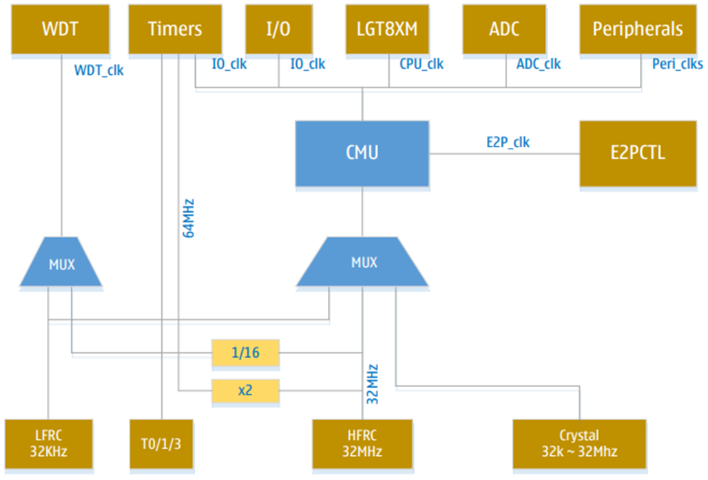
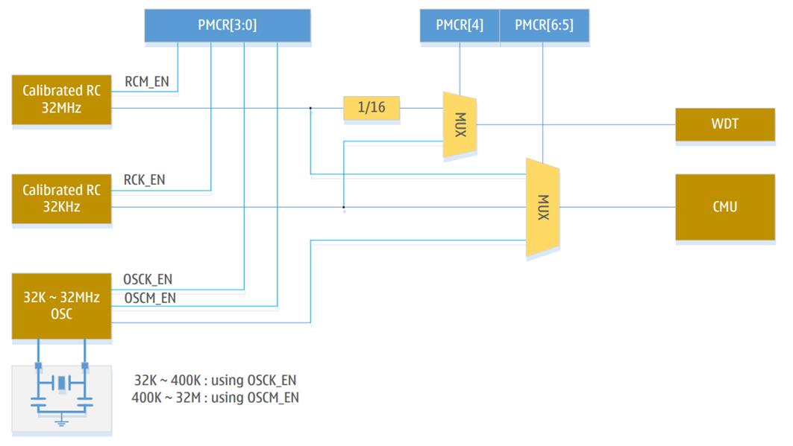

# Система тактирования

## Распределение тактирования

Семейство микроконтроллеров LGT8FX8P поддерживает три основных источника тактовой частоты:
+ Внутренний калиброванный низкочастотный RC-генератор (32 кГц);
+ Внутренний калиброванный низкочастотный RC-генератор (32 МГц);
+ Внешний вход для кварцевого резонатора (32 кГц ~ 32 МГц).

На рисунке ниже показана структурная схема системы распределения тактирования LGT8FX8P. «CMU» является центром управления тактовой частотой, отвечающим за разделение частот системной синхронизации, генерацию независимых тактовых импульсов для различных модулей, управление тактовой частотой и т. д.
 
В общих приложениях не все источники тактитрования должны работать одновременно. Чтобы снизить энергопотребление системы, управление питанием системы отключает неиспользуемые тактовые импульсы модулей в соответствии с различными режимами сна. Подробную информацию об эксплуатации см. в соответствующих главах, посвященных управлению энергопотреблением.
### CPU_clk
Используется для управления работой ядра LGT8XM и SRAM. Например, управление общими рабочими регистрами, регистрами состояния и т.д. Если тактовая частота процессора остановлена, ядро не будет выполнять инструкции и вычисления. После того, как система выполнит инструкцию SLEEP для перехода в спящий режим, тактовая частота ядра будет отключена.
### Peri_clk
Используется для управления большинством периферийных модулей, таких как таймер/счетчик, SPI, USART и т.д. Тактовый сигнал ввода-вывода также используется для управления внешним модулем прерываний. Если тактирование периферии останавлено в режиме сна, некоторые периферийные устройства, которые могут работать в независимом тактовом или асинхронном режиме, можно использовать для пробуждения системы. Например, функция распознавания адреса TWI может вывести из большинства спящих режимов, т.к. она работает в асинхронном режиме.
### E2P_clk
Тактовый сигнал E2P_clk используется для генерации сигналов доступа к интерфейсу FLASH памяти. E2P_clk привязан к внутреннему высокочастотному RC-генератору 32 МГц, делённому на 32 (1 МГц). Если необходимо использовать модуль E2PCTL для чтения и записи внутренней программной FLASH-памяти или FLASH-памяти данных, необходимо включить этот генератор.
### Asy_clk
Асинхронный таймер. Таймер/счетчик может управляться напрямую внешним тактовым сигналом или кварцевым генератором (32,768 КГц). Этот независимый режим часов позволяет таймеру продолжать работать, пока система находится в спящем режиме.
### WDT_clk
Источник тактовой частоты внутреннего сторожевого таймера можно настроить на использование внутреннего низкочастотного RC-генератора 32 кГц или внутреннего высокочастотного RC-генератора 32 МГц, деленного на 16 (2 МГц). После включения системы источником тактовой частоты сторожевого таймера по умолчанию является низкочастотный RC-генератор с частотой 32 кГц.
 
## Выбор источника тактирования
В LGT8FX8P используется 4 сигнала для выбора источника тактирования. Управление источниками тактирования и переключение между ними осуществляется через регистр PMCR. Ниже представлена структурная схема:
 
Генератор «OSC» может работать в высокочастотном или низкочастотном режиме, его необходимо корректно настроить в соответствии с используемым внешним кварцевым резонатором. Внутренний RC-генератор состоит из высокочастотного и низкочастотного. Для управления этими источниками тактовой частоты используются 4 младших бита регистра PMCR.

Соответствие бит следующее:
|PMCR|Источник тактирования|
|-|-|
|PMCR[0] (RCMEN)|32MHz RC-генератор, 1-вкючен, 0-выключен|
|PMCR[1] (RCKEN)|32KHz RC-генератор, 1-вкючен, 0-выключен|
|PMCR[2] (OSCMEN)|400K ~ 32MHz кварцевый генератор, 1-вкючен, 0-выключен|
|PMCR[3] (OSCKEN)|32K ~ 400K кварцевый генератор, 1-вкючен, 0-выключен|

После включения системы LGT8FX8P в качестве источника тактовых импульсов по умолчанию используется высокочастотный внутренний RC-генератор с частотой 32МГц и делением на 8 (4МГц). Для изменения конфигурации необходимо использовать регистр PMCR и регистр предварительного делителя частоты системы CLKPR.
Для изменения источника тактовых импульсов необходимо сначала включить требуемый источник синхронизации через PMCR[3:0], а затем дождаться его стабильного рабочего состояния.
Например, если выбрать в качестве источника тактовых импульсов внешний кварцевый генератор, который не сможет начать генерацию из-за ошибок конфигурации или поломки кварцевого резонатора, то после переключения система перестанет работать. Поэтому, для увеличения надежности системы, рекомендуется включать сторожевой таймер, чтобы избежать подобных проблем с точки зрения разработки программного обеспечения.
После включения генератора и ожидания его стабильной работы, можно переключить источник тактирования через PMCR[6:5]. Бит PMCR[5] (CLKSS) используется для выбора внутреннего RC-генератора или внешнего кварцевого генератора, а PMCR[6] (CLKFS) используется для выбора высокочатотного или низкочастотного источника тактовой частоты.

Выбор основного источника тактирования:
|PMCR[6] (CLKFS)|PMCR[5] (CLKSS)|Источник тактирования|
|:-:|:-:|:-|
|0|0|Внутренний RC-генератор 32МГц (по умолчанию)|
|0|1|Внешний высокочастотный кварцевый резонатор 400кГц ~ 32МГц|
|1|0|Внутренний RC-генератор 32кГц|
|1|1|Внешний низкочастотный кварцевый резонатор 32кГц ~ 400кГц|

### Синхронизация источника тактовых импульсов
Чтобы защитить регистр PMCR от случайного изменения, необходимо выполнять настройку строго в соответствии с указанным временем. Самый старший бит регистра PMCR[7] (PMCE) используется для управления записью. Перед изменением других битов регистра PMCR необходимо сначала установить PMCE в 1 и изменить значения других регистров PMCR в течение 6 циклов после операции установки. После 6 циклов прямые модификации PMCR станут неэффективными.
Рассмотрим в качестве примера переключение на внешний высокочастотный кварцевый генератор. Ниже перечислены рекомендуемые шаги:
1. Включить источник синхронизации:
    - Установить PMCE=1;
    - В течение 6 циклов установите OSCMEN=1, чтобы включить внешний высокочастотный режим кварцевого генератора;
    - Дождитесь стабилизации внешнего кварцевого генератора (время ожидания зависит от кварцевого генератора, обычно достаточно фиксированного времени ожидания).
2. Переключение основного источника синхронизации:
    - Установить PMCE=1;
    - В течение 6 циклов установите PMCR[6:5]=01, и система автоматически переключит источник тактовых импульсов на внешний кварцевый генератор;
    - Выполните несколько операций NOP для повышения стабильности (необязательно).

> Примечание: в вышеописанной операции переключения источника тактовых импульсов необходимо убедиться, что текущий генератор работает нормально. После переключения на внешний кварцевый генератор можно отключить внутренний RC-генератор.
 
## Управление предделителем системы тактирования
LGT8FX8P оснащен предварительным делителем тактовой частоты, которым можно управлять с помощью регистра CLKPR. Эта функция может быть использована для снижения энергопотребления системы, когда не требуется высокая вычислительная мощность. Предделитель используется для всех источников тактовой частоты, поддерживаемых системой. Он влияет на тактовую частоту ядра и, следовательно, на все периферийные устройства.
При изменении параметров предварительного делителя тактовой частоты, гарантируется отсутствие сбоев в процессе переключения. Переключение частоты выполняется после изменения регистра CLKPR и вступает в силу максимум через 2~3 текущих цикла системных часов.

Чтобы избежать неправильной работы регистра делителя тактовой частоты, модификация CLKPR также должна следовать специальной процедуре синхронизации:
1. Установите бит разрешения изменения предварительного делителя тактовой частоты CLKPCE=1, а все остальные биты CLKPR=0;
2. В течение четырех циклов запишите требуемое значение в CLKPS и одновременно запишите 0 в CLKPR.

Перед изменением регистра предварительного делителя тактовой частоты необходимо отключить функцию прерывания, чтобы гарантировать возможность завершения последовательности записи. Конкретное определение основного регистра предварительного делителя тактовой частоты CLKPR см. в разделе описания регистров в данной главе.

### Калибровка внутреннего RC-генератора
LGT8FX8P содержит два калибруемых RC-генератора, которые после калибровки могут достигать точности в пределах ±1%. Один из них с частотой 32 МГц используется по умолчанию в качестве тактовой частоты системы. Перед выпуском LGT8FX8P RC-генераторы были откалиброваны, и значение калибровки было записано в область информации о конфигурации системы. В процессе включения системы эти калибровочные значения будут считаны во внутренний регистр, с помощью которого частота RC-генераторов будет повторно откалибрована. Калибровочный регистр расположен в адресном пространстве ввода-вывода, и пользовательская программа может выполнять чтение и запись.
Для применений с особыми требованиями к частоте, частотный выход внутреннего генератора можно регулировать, изменяя значение калибровочного регистра. Изменение калибровочного регистра не приведет к изменению заводской конфигурации. При повторном включении системы или повторной загрузке битов конфигурации, инициированных пользователем, заводские настройки калибровочного регистра будут восстановлены.
 
## Описание регистров

### Регистр калибровки высокочастотного генератора 32МГц - RCMCAL
|Имя|Адрес|Значение по умолчанию|
|-|-|-|
|RCMCAL|0x66|Заводская конфигурация|

|Бит|Доступ|Имя|Описание|
|-|-|-|-|
|7:0|R/W|RCCAL|После включения питания системы значение регистра будет заменено значением калибровки RC в информации о конфигурации системы|

### Регистр калибровки низкочастотного генератора 32кГц - RCKCAL
|Имя|Адрес|Значение по умолчанию|
|-|-|-|
|RCKCAL|0x67|Заводская конфигурация|

|Бит|Доступ|Имя|Описание|
|-|-|-|-|
|7:0|R/W|RCKCAL|Запишите калибровочное значение в регистр RCKCAL, чтобы завершить калибровку RC-генератора частотой 32 кГц|

### Регистр управления источником синхронизации - PMCR
|Регистр|Адрес|Значение по умолчанию|
|-|-|-|
|PMCR|0xF2|0x03|

|Бит|Доступ|Имя|Описание|
|-|-|-|-|
|0|R/W|RCMEN|Встроенный RC-генератор 32 МГц, 1 – включен, 0 – выключен|
|1|R/W|RCKEN|Встроенный RC-генератор 32 кГц, 1 – включен, 0 – выключен|
|2|R/W|OSCMEN|Внешний высокочастотный кварцевый резонатор, 1 – включен, 0 – выключен|
|3|R/W|OSCKEN|Внешний низкочастотный кварцевый резонатор, 1 – включен, 0 – выключен|
|4|R/W|WCLKS|Выбор источника тактовой частоты WDT: 0 – Высокочастотный RC-генератор 32 МГц с делением на 16, 1 – Внутренний RC-генератор 32 кГц.|
|5|R/W|CLKSS|Выбор основного источника тактирования|
|6|R/W|CLKFS|Выбор основного источника тактирования|
|7|R/W|PMCE|Уравляющий бит изменения регистра|

>Перед изменением регистра PMCR необходимо установить бит PMCE, а затем в течение четырех тактов установить значения других битов.

|PMCR[6] (CLKFS)|PMCR[5] (CLKSS)|Источник тактирования|
|:-:|:-:|:-|
|0|0|Внутренний RC-генератор 32МГц (по умолчанию)|
|0|1|Внешний высокочастотный кварцевый резонатор 400кГц ~ 32МГц|
|1|0|Внутренний RC-генератор 32кГц|
|1|1|Внешний низкочастотный кварцевый резонатор 32кГц ~ 400кГц|

### Регистр управления предделителем- CLKPR
|Регистр|Адрес|Значение по умолчанию|
|-|-|-|
|CLKPR|0x61|0x03|

|Бит|Доступ|Имя|Описание|
|-|-|-|-|
|0:3|R/W|CLKPS|Коэффициент деления|
|4|-|-|Не используется|
|5|R/W|CKOEN0|Вывод тактирования в порт PB0|
|6|R/W|CKOEN1|Вывод тактирования в порт PE5|
|7|R/W|WCE|Уравляющий бит изменения регистра|

>Перед изменением других битов регистра CLKPR необходимо установить значение WCE=1, а затем остальные биты должны быть установлены в течении следующих четырех системных тактов. По истечении четырех тактов значение WCE автоматически обнуляется.

|CLKPS3|CLKPS2|CLKPS1|CLKPS0|Значение|
|-|-|-|-|-|
|0|0|0|0|1|
|0|0|0|1|2|
|0|0|1|0|4|
|0|0|1|1|8 (по умолчанию)|
|0|1|0|0|16|
|0|1|0|1|32|
|0|1|1|0|64|
|0|1|1|1|128|
|1|0|0|0|256|

>Другие значения - Зарезервированы
