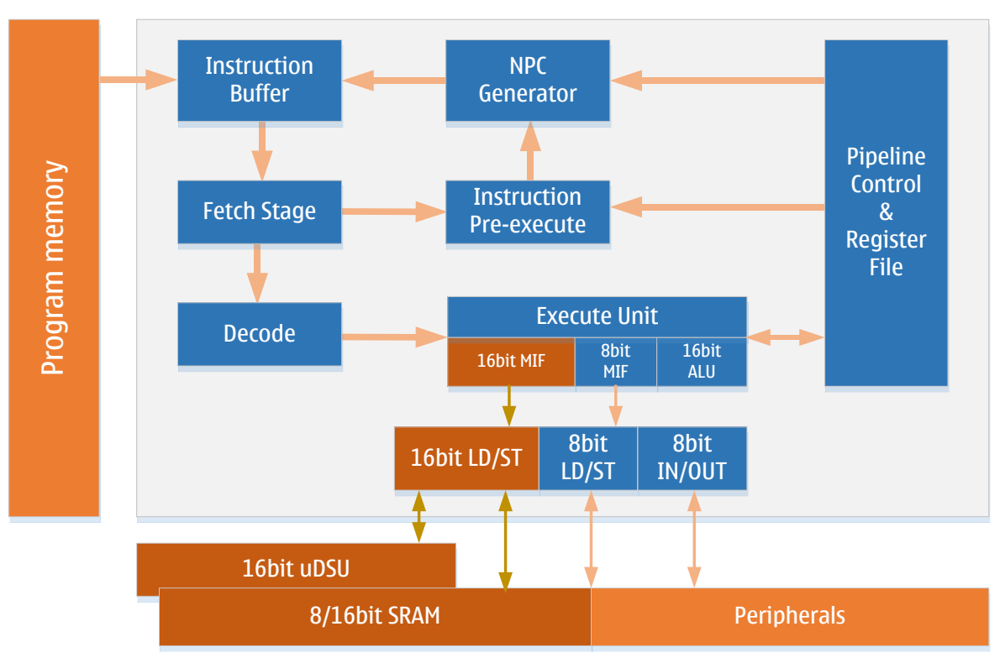
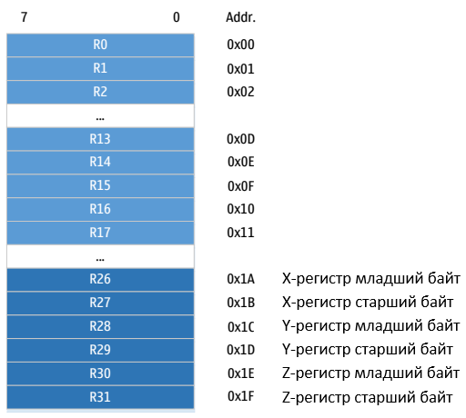
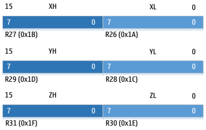
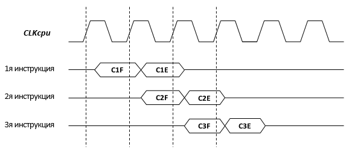
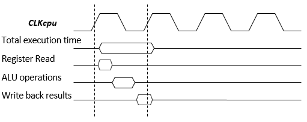

# Ядро

- Низкое энергопотребление
- Высокоэффективная RISC-архитектура
- 16-битное расширение LD/ST (для uDSU)
- 130 инструкций, из которых более 80% выполняются за один такт
- Встроенная поддержка отладки в реальном времени (OCD)

## Обзор
В этом разделе описывается архитектура и функции ядра LGT8XM. Ядро является "мозгом" микроконтроллера (MCU) и отвечает за корректное выполнение программ. Поэтому ядро должно точно выполнять вычисления, управлять периферийными устройствами и обрабатывать различные прерывания.

## Архитектура


Для достижения большей эффективности и параллелизма ядро LGT8XM использует Гарвардскую архитектуру — раздельные шины для данных и команд.

Инструкции выполняются через оптимизированный двухступенчатый конвейер, который уменьшает количество неэффективных инструкций в конвейере и снижает количество обращений к FLASH-памяти программ, что, в свою очередь, снижает энергопотребление ядра.

Кроме того, в ядре LGT8XM добавлен кэш инструкций (может кэшировать до 2 инструкций) на этапе выборки инструкций. Благодаря модулю предварительного выполнения в цикле выборки инструкций, частота обращений к FLASH-памяти программ дополнительно снижается. Многочисленные тесты показали, что ядро LGT8XM может сократить количество обращений к FLASH-памяти примерно на 50% по сравнению с другими аналогичными архитектурами, что значительно снижает энергопотребление системы.

Ядро LGT8XM имеет 32 8-битных высокоскоростных регистра общего назначения (Register file), что способствует выполнению арифметико-логических операций (ALU) за один такт. Обычно оба операнда для операций ALU берутся из регистров общего назначения, а результат операции ALU записывается в регистровый файл за один такт.

32 рабочих регистра, из которых 6 используются для создания трех 16-битных регистров. Эти регистры могут использоваться для косвенной адресации указателей, что позволяет обращаться к внешнему адресному пространству и пространству FLASH-памяти программ. Ядро LGT8XM поддерживает 16-битные арифметические операции за один такт, что значительно повышает эффективность косвенной адресации. Эти три специальных 16-битных регистра в ядре LGT8XM называются X, Y и Z, и они будут подробно описаны далее.

Арифметико-логическое устройство (ALU) поддерживает арифметические и логические операции между регистрами, а также между константами и регистрами. Также ALU может выполнять операции с одним регистром. После завершения операции ALU результат влияет на состояние ядра, и это состояние обновляется в регистре состояния (SREG).

Управление потоком программы осуществляется с помощью условных и безусловных переходов/вызовов, которые могут адресовать любую область программы. Большинство инструкций LGT8XM являются 16-битными. Каждое адресное пространство программы соответствует одной 16-битной или 32-битной инструкции LGT8XM.

Когда ядро реагирует на прерывание или вызов подпрограммы, адрес возврата (PC) сохраняется в стеке. Стек размещается в общей SRAM-памяти данных системы, поэтому размер стека ограничен только объемом SRAM и ее использованием. Все приложения, поддерживающие прерывания или вызовы подпрограмм, должны сначала инициализировать регистр указателя стека (SP), который доступен через пространство ввода-вывода (I/O). SRAM-память данных может быть доступна через пять различных режимов адресации. Внутреннее адресное пространство LGT8XM линейно отображается в единое адресное пространство. Подробности см. в разделе, посвященном памяти.

Ядро LGT8XM включает гибкий контроллер прерываний. Функции прерываний могут управляться с помощью глобального бита разрешения прерываний в регистре состояния. Каждое прерывание имеет собственный вектор. Приоритет прерывания соответствует адресу вектора прерывания: чем меньше адрес, тем выше приоритет.

Пространство ввода-вывода (I/O) содержит 64 регистра, которые могут быть напрямую адресованы с помощью инструкций IN/OUT. Эти регистры управляют функциями ядра, регистрами состояния, SPI и другими периферийными устройствами ввода-вывода. Это пространство может быть доступно напрямую через инструкции IN/OUT или через их отображение в адресное пространство данных (0x20 – 0x5F). Кроме того, LGT8FX8P включает расширенное пространство ввода-вывода, которое отображается в адресное пространство данных 0x60 – 0xFF и доступно только через инструкции ST/STS/STD и LD/LDS/LDD.

Для повышения вычислительной мощности ядра LGT8XM в конвейер инструкций добавлено 16-битное расширение LD/ST. Это расширение работает в сочетании с 16-битным блоком ускорения вычислений (uDSU), обеспечивая эффективные 16-битные операции. Также ядро поддерживает 16-битный доступ к RAM-памяти. Таким образом, 16-битное расширение LD/ST позволяет передавать 16-битные данные между uDSU, RAM и рабочими регистрами. Подробности см. в разделе "Блок ускорения вычислений".

## Арифметико-логическое устройство (ALU):
Ядро LGT8XM включает 16-битное арифметико-логическое устройство, способное выполнять 16-битные арифметические операции за один такт. Эффективное ALU связано с 32 регистрами общего назначения и может выполнять арифметические и логические операции между двумя регистрами или между регистром и константой за один такт. Операции ALU делятся на три типа: арифметические, логические и побитовые. Кроме того, ALU включает однотактный аппаратный умножитель, который может выполнять умножение двух 8-битных регистров (знаковых или беззнаковых) за один такт. Подробности см. в разделе, посвященном набору инструкций.

## Регистр состояния (SREG):
Регистр состояния хранит информацию о результатах последней операции ALU. Эта информация используется для управления потоком выполнения программы. Регистр состояния обновляется после завершения операции ALU, что позволяет избежать использования отдельных инструкций сравнения и делает код более компактным и эффективным. Значение регистра состояния не сохраняется и не восстанавливается автоматически при входе и выходе из прерывания, это должно быть реализовано программно.

|Регистр|Адрес|Значение по умолчанию|
|-|-|-|
|SREG|0x3F (0x5F)|0x00|

|Бит|Доступ|Имя|Описание|
|-|-|-|-|
|0|R/W|C|Флаг переноса указывает, что арифметическая или логическая операция привела к переносу. Подробности смотрите в описании инструкции.|
|1|R/W|Z|Флаг нуля, указывающий, что результат арифметической или логической операции равен нулю. Пожалуйста, обратитесь к разделу описания инструкции|
|2|R/W|N|Знак «минус», указывающий, что арифметическая или логическая операция дает отрицательное число. Пожалуйста, обратитесь к разделу описания инструкции|
|3|R/W|V|Флаг переполнения, указывающий на переполнение результата двоичной операции дополнения. Пожалуйста, обратитесь к разделу описания инструкции|
|4|R/W|S|Знаковый бит, эквивалентный результату XOR N и V. Подробности см. в разделе описания инструкций.|
|5|R/W|H|Флаг полупереноса, полезный в работе с двоично-десятичным кодом, указывает, что операция с байтом генерирует полуперенос.|
|6|R/W|T|Временный бит, используемый в инструкциях копирования битов (BLD) и хранения битов (BST). Бит T будет использоваться как временный бит хранения для временного сохранения значения бита в общем регистре.Подробную информацию смотрите в разделе с описанием инструкции.|
|7|R/W|I|Глобальный бит разрешения прерываний. Этот бит должен быть установлен в 1, чтобы ядро ​​могло реагировать на события прерываний. Различные источники прерываний управляются независимыми битами управления. Глобальный бит разрешения прерываний — это последний барьер, который контролирует сигнал прерывания, поступающий в ядро. Бит I автоматически очищается аппаратно после того, как ядро ​​ответит на вектор прерывания, и автоматически устанавливается после выполнения инструкции возврата прерывания (RETI). Бит I также можно изменить с помощью инструкций SEI и CLI, см. раздел с описанием инструкций.|

## Рабочие регистры
Рабочие регистры оптимизированы в соответствии с архитектурой набора инструкций LGT8XM. Для достижения эффективности и гибкости, необходимых для выполнения ядра, общие рабочие регистры внутри LGT8XM поддерживают следующие режимы доступа:
- Одна 8-битная операция чтения и одна 8-битная операция записи одновременно
- Два 8-битных чтения и одна 8-битная запись одновременно
- Две 8-битные операции чтения и одна 16-битная операция записи одновременно
- Одновременная операция чтения и записи 16-битных данных



Большинство инструкций могут напрямую обращаться ко всем общим рабочим регистрам, и большинство из них являются однотактовыми инструкциями.
Как показано на рисунке выше, каждый регистр соответствует адресу в пространстве хранения данных, и эти общие рабочие регистры отображаются в пространстве хранения данных. Хотя на самом деле они не существуют в SRAM, эта единообразно отображаемая организация хранения данных обеспечивает большую гибкость в доступе к ним. Регистры X/Y/Z можно использовать в качестве указателей для индексации любого регистра общего назначения.

### Регистры X/Y/Z
Регистры R26…R31 можно объединять попарно, образуя три 16-битных регистра. Эти три 16-битных регистра в основном используются для адресных указателей косвенного адресного доступа. Структура регистров X/Y/Z следующая:



В различных режимах адресации эти регистры используются как фиксированные смещенные, автоинкрементные и автодекрементные указатели адреса. Подробности см. в разделе описания инструкций.

## Указатель стека

Стек используется для хранения временных данных, локальных переменных, а также адресов возврата при вызовах подпрограмм и прерываний. Важно отметить, что стек разработан для роста от старших адресов к младшим. Регистр указателя стека (SP) всегда указывает на вершину стека. Указатель стека указывает на физическое пространство SRAM, где находится стек, необходимый для вызовов подпрограмм или прерываний. Инструкция **PUSH** приводит к уменьшению указателя стека.

Положение стека в SRAM должно быть правильно установлено программным обеспечением перед выполнением подпрограмм или включением прерываний. Обычно указатель стека инициализируется на самый верхний адрес SRAM. Указатель стека должен быть установлен на начало старших адресов SRAM. Адреса SRAM в системном отображении памяти данных см. в разделе системной памяти данных.

### Инструкции, связанные с указателем стека

| Инструкция | Указатель стека | Описание |
|------------|----------------|----------|
| PUSH       | Увеличивается на 1 | Данные помещаются в стек |
| CALL, ICALL, RCALL | Увеличивается на 2 | Адрес возврата при вызове подпрограммы или прерывания помещается в стек |
| POP        | Уменьшается на 1 | Данные извлекаются из стека |
| RET, RETI  | Уменьшается на 2 | Адрес возврата извлекается из стека |

Указатель стека состоит из двух 8-битных регистров, расположенных в пространстве ввода-вывода (I/O). Фактическая длина указателя стека зависит от реализации системы. В некоторых реализациях архитектуры LGT8XM объем данных настолько мал, что для адресации достаточно только регистра SPL. В таких случаях регистр SPH не используется.

### Регистры указателя стека SPH/SPL

|Регистр|Адрес|Значение по умолчанию|
|-|-|-|
|SPH|0x3E (0x5E)|RAMEND|
|SPL|0x3D (0x5D)|RAMEND|

|Бит|Доступ|Имя|Описание|
|-|-|-|-|
|7:0|R/W|SPL|Младшие 8 бит указателя стека|
|15:8|R/W|SPH|Старшие 8 бит указателя стека|

## Временные характеристики выполнения инструкций

Этот раздел описывает общие временные характеристики выполнения инструкций. Ядро LGT8XM управляется тактовым сигналом ядра (CLKcpu), который поступает непосредственно от схемы выбора системного тактового сигнала.



На следующем рисунке показана временная диаграмма выполнения инструкций на основе концепции Гарвардской архитектуры и быстрого доступа к регистровому файлу. Это обеспечивает физическую гарантию эффективности выполнения ядра на уровне 1 MIPS/MHz.

Из рисунка видно, что во время выполнения первой инструкции одновременно происходит чтение второй инструкции. Когда вторая инструкция начинает выполняться, одновременно читается третья инструкция. Таким образом, в течение всего времени выполнения не требуется тратить дополнительные циклы на чтение инструкций, что позволяет достичь эффективности выполнения одной инструкции за каждый такт.

На следующем рисунке показана временная диаграмма доступа к регистрам общего назначения. В течение одного такта ALU использует два регистра в качестве операндов и записывает результат выполнения ALU в целевой регистр в том же такте.



## Сброс и обработка прерываний

LGT8XM поддерживает несколько источников прерываний. Эти прерывания, а также вектор сброса, имеют отдельные точки входа в программном пространстве. Как правило, каждое прерывание имеет отдельный управляющий бит. Когда этот бит установлен и включен глобальный бит разрешения прерываний в ядре, ядро может реагировать на это прерывание.

Нижняя часть программного пространства по умолчанию зарезервирована для векторов сброса и прерываний. Полный список прерываний, поддерживаемых LGT8FX8P, приведен в разделе, посвященном прерываниям. Этот список также определяет приоритеты прерываний. Прерывания с более низкими адресами векторов имеют более высокий приоритет. Сброс (RESET) имеет наивысший приоритет, за ним следует INT0 – внешний запрос прерывания 0. Начальный адрес таблицы векторов прерываний (за исключением вектора сброса) может быть переопределен на любое выравненное по 256 байт начало с помощью бита IVSEL в регистре управления MCU (MCUCR) и регистра базового адреса векторов IVBASE.

Когда ядро реагирует на прерывание, глобальный флаг разрешения прерываний I автоматически сбрасывается аппаратно. Пользователь может включить вложенные прерывания, установив бит I. В этом случае любое последующее прерывание может прервать текущую процедуру обработки прерывания. Бит I автоматически устанавливается при выполнении инструкции возврата из прерывания (RETI), что позволяет нормально реагировать на последующие прерывания.

Существует два основных типа прерываний. Первый тип инициируется событием, которое устанавливает флаг прерывания. Для таких прерываний, когда ядро реагирует на запрос прерывания, текущее значение PC заменяется на адрес вектора прерывания, и выполняется соответствующая процедура обработки прерывания, при этом флаг прерывания автоматически сбрасывается аппаратно. Флаг прерывания также может быть сброшен путем записи 1 в соответствующую позицию флага. Если прерывание происходит, когда бит разрешения прерывания сброшен, флаг прерывания все равно будет установлен для регистрации события прерывания. Когда прерывание будет разрешено, это зарегистрированное событие будет немедленно обработано. Аналогично, если глобальный бит разрешения прерываний (SREG.I) сброшен при возникновении прерывания, соответствующий флаг прерывания будет установлен для регистрации события прерывания, и когда глобальный бит разрешения прерываний будет установлен, эти зарегистрированные прерывания будут обработаны в соответствии с их приоритетами.

Второй тип прерываний возникает, когда условие прерывания сохраняется, и прерывание продолжает обрабатываться. Для таких прерываний не требуется флаг прерывания. Если условие прерывания исчезает до того, как прерывание будет разрешено, это прерывание не будет обработано.

Когда ядро LGT8XM завершает выполнение процедуры обработки прерывания, управление возвращается в основную программу. В основной программе должно быть выполнено одна или несколько инструкций, прежде чем можно будет обработать другие ожидающие запросы прерываний.

Важно отметить, что регистр состояния системы (SREG) не сохраняется автоматически при входе в процедуру обработки прерывания и не восстанавливается автоматически при выходе из нее. Это должно быть обработано программно.

Когда прерывания запрещены с помощью инструкции CLI, прерывания немедленно отключаются. Никакие прерывания, происходящие после выполнения инструкции CLI, не будут обработаны. Даже прерывания, происходящие одновременно с выполнением CLI, не будут обработаны. В следующем примере показано, как использовать CLI для предотвращения нарушения временных характеристик записи в EEPROM из-за прерываний:

Пример кода на Ассемблере
```
IN R16, SREG    ; сохранить значение SREG
CLI             ; отключить прерывания
SBI EECR, EEMPE ; начать запись EEPROM
SBI EECR, EEPE
OUT SREG, R16   ; восстановить значение SREG (включая бит I)
```
Пример кода на языке С
```
char cSREG;
cSREG = SREG;           // сохранить значение SREG
_CLI();                 // отключить прерывания
EECR | = (1 << EEMPE);  // начать запись EEPROM
EECR | = (1 << EEPE);
SREG = cSREG;           // восстановить значение SREG (включая бит I)
```

Когда прерывания разрешены инструкцией SEI, команда, следующая за инструкцией SEI, будет выполнена до того, как прерывание сработает, например:

Пример кода на Ассемблере
```
SEI             ; установить глобальный флаг разрешения прерываний
SLEEP           ; переход в режим сна, ожидая прерывания
; note: войдет в сон перед любым ожидающим прерыванием
```

Пример кода на языке С 
```
__enable_interrupt ();  // установить глобальный флаг разрешения прерываний
__sleep();              // переход в режим сна, ожидая прерывания
// note: войдет в сон перед любым ожидающим прерыванием
```

## Время отклика на прерывание

Ядро LGT8XM оптимизировано для быстрого реагирования на прерывания, что гарантирует обработку любого прерывания в течение 4 системных тактов. Через 4 системных такта начинается выполнение процедуры обработки прерывания. В течение этих 4 тактов значение PC (счетчика команд) до прерывания сохраняется в стеке, и выполнение программы переходит к процедуре обработки прерывания, соответствующей вектору прерывания. Если прерывание происходит во время выполнения многотактной инструкции, ядро гарантирует корректное завершение текущей инструкции.

Если прерывание происходит, когда система находится в режиме сна (SLEEP), время отклика на прерывание увеличивается на дополнительные 4 такта. Эти дополнительные такты необходимы для синхронизации при выходе из выбранного режима сна. Подробное описание режимов сна см. в разделе, посвященном управлению энергопотреблением.

Возврат из процедуры обработки прерывания занимает 2 такта. В течение этих 2 тактов значение PC восстанавливается из стека, указатель стека увеличивается на 2, и глобальный бит разрешения прерываний автоматически включается.