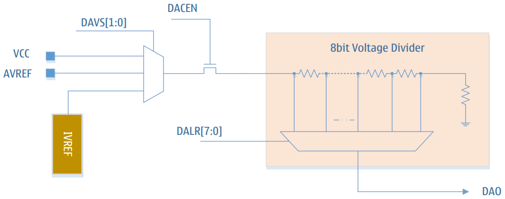

# Цифро-аналоговый преобразователь (ЦАП)

- 8-битный цифро-аналоговый выход
- Выход ЦАП может использоваться как опорный вход аналогового компаратора
- Поддержка выхода ЦАП на внешний вывод (DAO)
- Выбор источника питания делителя: VCC / AVREF / IVREF

## Обзор

LGT8FX8P имеет встроенный 8-битный программируемый цифро-аналоговый преобразователь (ЦАП). В качестве источника опорного напряжения для ЦАП может быть выбрано: напряжение системного питания, внутренний источник опорного напряжения или внешний вход AVREF. Выход ЦАП может использоваться как вход внутренних компараторов AC0/AC1, а также выводиться непосредственно на внешний вывод микроконтроллера для использования в качестве внешнего опорного напряжения. При выводе ЦАП на внешний вывод он не может непосредственно использоваться для нагрузки — требуется буферная схема, такая как повторитель напряжения или аналогичная. Внутренняя структура ЦАП показана на рисунке ниже:

## Определения регистров

### DACON – Регистр управления ЦАП

| Адрес: 0xA0 | Значение по умолчанию: 0x00 |
|---|---|

| Бит | 7 | 6 | 5 | 4 | 3 | 2 | 1 | 0 |
|-----|---|---|---|---|---|---|---|---|
| Имя | - | - | - | - | DACEN | DAOE | DAVS1 | DAVS0 |
| Доступ | - | - | - | - | R/W | R/W | R/W | R/W |

#### Описание битов

| Бит | Имя | Описание |
|-----|-----|----------|
| 7:4 | - | Зарезервировано |
| 3 | DACEN | Бит разрешения ЦАП: 1: включить модуль ЦАП 0: отключить модуль ЦАП |
| 2 | DAOE | Управление выводом ЦАП на внешний порт: 1: разрешить вывод ЦАП на внешний порт PD4 0: запретить вывод ЦАП на внешний порт |
| 1 | DAVS1 | Биты выбора источника опорного напряжения ЦАП (старший) |
| 0 | DAVS0 | Биты выбора источника опорного напряжения ЦАП (младший).|

#### Выбор источника опорного напряжения

| DAVS[1:0] | Опорное напряжение |
|-|-|
| 00 | Напряжение системы VCC|
| 01 | Внешний вход AVREF |
| 10 | Внутренний опорный источник |
| 11 | Отключить источник опорного напряжения ЦАП (при этом также отключается модуль ЦАП) |

### DALR – Регистр данных ЦАП

| Адрес: 0xA1 | Значение по умолчанию: 0x00 |
|---|---|

| Бит | 7:0 |
|-----|-|
| Имя | DALR[7:0] |
| Доступ | R/W |

#### Описание битов

| Бит | Имя | Описание |
|-----|-----|----------|
| 7:0 | DALR | Регистр данных ЦАП. Устанавливает величину выходного напряжения ЦАП. **Формула выходного напряжения:** V_DAO = V_REF * (DALR + 1) / 256, где: V_DAO – выходное аналоговое напряжение ЦАП V_REF – источник опорного напряжения ЦАП (выбирается битами DAVS в регистре DACON)|
