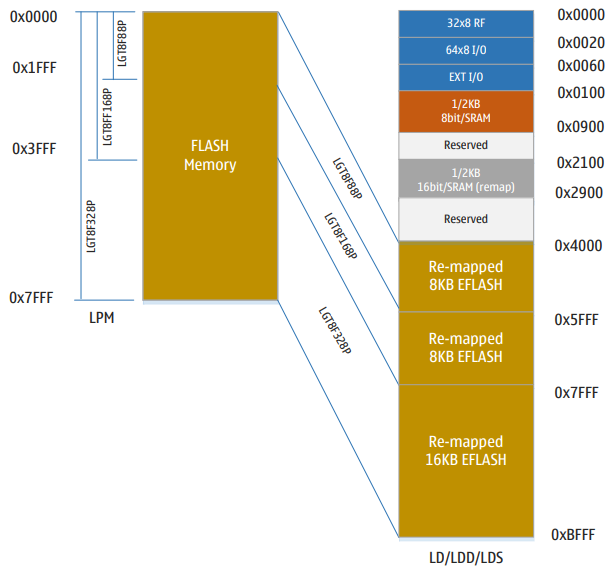
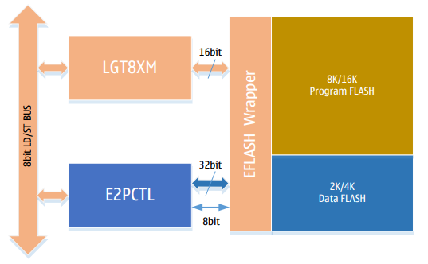
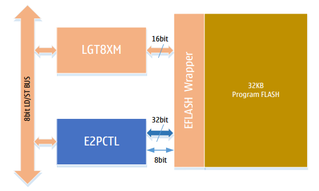
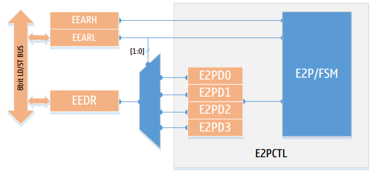
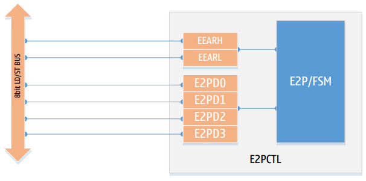
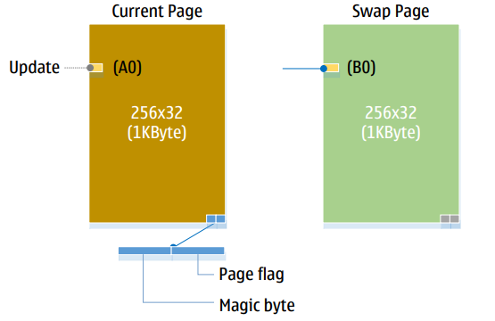
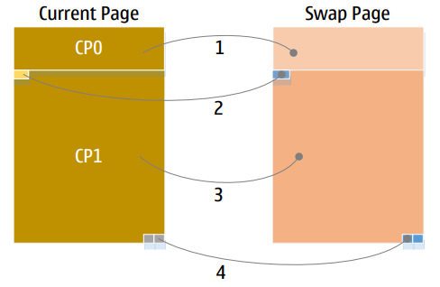
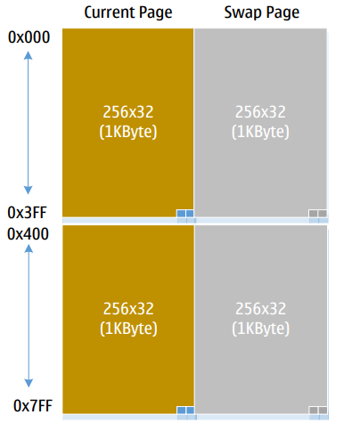

# Память

## Обзор

В данной главе описана доступная память в серии микроконтроллеров **LGT8FX8P**. Архитектура поддерживает два основных типа внутреннего адресного пространства: пространство данных и пространство программ. **LGT8FX8P** также содержит внутреннюю **FLASH**-память данных, которая через внутренний контроллер реализует функциональность хранения данных с интерфейсом **EEPROM**. Кроме того, в системе **LGT8FX8P** присутствуют специальные ячейки памяти для хранения конфигурации системы и глобального уникального идентификатора (**GUID**) микросхемы.

Серия микроконтроллеров **LGT8FX8P** включает четыре различные модели: **LGT8F88P/168P/328P**. Периферийные устройства и корпуса этих четырёх моделей полностью совместимы. Отличия заключаются в объёме программной **FLASH**-памяти и внутренней **SRAM**-памяти данных. В следующей таблице наглядно представлены различные конфигурации памяти для серии **LGT8FX8P**:

| Устройство   | FLASH  | SRAM   | E2PROM   | Вектор прерывания    |
|--------------|--------|--------|----------|----------------------|
| LGT8F88P     | 8 КБ   | 1 КБ   | 2 КБ     | 1 командное слово    |
| LGT8F168P    | 16 КБ  | 1 КБ   | 4 КБ     | 2 командных слова    |
| LGT8F328P    | 32 КБ  | 2 КБ   | 0/1/2/4/8 КБ (настраивается, разделяется с FLASH) | 2 командных слова |

**LGT8F328P** не имеет отдельного внутреннего **FLASH**-пространства для эмуляции интерфейса **E2PROM**. Пространство памяти для эмуляции **E2PROM** разделяется с программной **FLASH**-памятью. Пользователь может выбрать подходящую конфигурацию в соответствии с требованиями приложения.

Из-за особенностей реализации эмуляции интерфейса **E2PROM** системе требуется вдвое больше программной **FLASH**-памяти для создания объёма эмуляции **E2PROM**. Например, для **LGT8F328P**: если пользователь настраивает **1 КБ** пространства **E2PROM**, то **2 КБ** программного пространства будут зарезервированы, а оставшиеся **30 КБ** **FLASH** будут доступны для хранения программы.

Таблица конфигурации разделения программной **FLASH** и **E2PROM** для **LGT8F328P**:

| FLASH  | E2PROM |
|-|-|
| 32 КБ  | 0 КБ   |
| 30 КБ  | 1 КБ   |
| 28 КБ  | 2 КБ   |
| 24 КБ  | 4 КБ   |
| 16 КБ  | 8 КБ   |

## Модуль ПЗУ (FLASH)

Микроконтроллеры серии LGT8FX8P содержат внутрикристальное внутрисхемно программируемое FLASH-устройство для хранения программ объёмом 8/16/32 КБ.

Программная FLASH-память выдерживает не менее 100 000 циклов стирания/записи. В LGT8FX8P интегрирован контроллер интерфейса FLASH, который обеспечивает внутрисистемное программирование (ISP) и возможность самообновления программы. Подробная информация приведена в соответствующем разделе данной главы, посвящённом контроллеру интерфейса FLASH.

К программному пространству можно обращаться напрямую (читать) с помощью инструкции `LPM`, что позволяет реализовывать прикладные таблицы констант. Кроме того, пространство программной FLASH отображается в системное пространство данных, поэтому пользователь также может обращаться к FLASH-памяти, используя инструкции `LD/LDD/LDS`. Пространство программ отображается в область данных, начиная с адреса `0x4000`, как показано на рисунке:

## Модуль ОЗУ (SRAM)

Микроконтроллеры серии LGT8FX8P являются относительно сложными микроконтроллерами и поддерживают множество различных типов периферийных устройств. Контроллеры этих устройств размещены в пространстве из 64 регистров ввода-вывода (I/O). К ним можно обращаться напрямую через инструкции `IN/OUT`. Регистры управления некоторых других периферийных устройств находятся в области `0x60` – `0xFF`. Поскольку эта область отображается в пространство данных, доступ к ней возможен только через инструкции `ST/STS/STD` и `LD/LDS/LDD`.

Системное пространство данных LGT8FX8P начинается с адреса `0` и включает в себя отображение файла рабочих регистров общего назначения, пространства I/O, расширенного пространства I/O и внутренней SRAM данных. Первые 32 байта адресуют 32 рабочих регистра общего назначения ядра LGT8FX8P. Следующие 64 адреса — это стандартное пространство I/O, доступное напрямую через инструкции `IN/OUT`. Затем следуют 160 адресов расширенного пространства I/O, а после них — до 2 КБ данных SRAM. Часть пространства с адреса `0x4000` по `0xFFFF` отображает программную FLASH-память.

Внутренняя SRAM-память объёмом 1/2 КБ отображается в две области. Область с `0x0100` по `0x0900` доступна ядру для чтения/записи 8-битными байтами. Область с `0x2100` по `0x2900` — это пространство доступа шириной шины 16 бит. Отображение SRAM в старшие адреса начиная с `0x2100` используется главным образом для совместной работы с модулем [uDSU](udsc.md), обеспечивая эффективное хранение 16-битных данных. При программировании, добавив смещение `0x2000` к адресу обычной 8-битной переменной, можно переключиться в 16-битный режим доступа.

Система поддерживает 5 различных режимов адресации, охватывающих всё пространство данных: прямая адресация, косвенная со смещением, косвенная, косвенная с предварительным уменьшением адреса, косвенная с последующим увеличением адреса. Рабочие регистры общего назначения `R26`–`R31` используются как указатели адреса при косвенной адресации. Косвенная адресация позволяет обращаться ко всему пространству данных. Косвенная адресация со смещением позволяет обращаться к 63 адресам относительно базового адреса в регистрах Y/Z.

При использовании режима косвенной адресации с автоматическим увеличением/уменьшением адреса регистры X/Y/Z автоматически увеличиваются или уменьшаются аппаратно до или после доступа. Подробнее см. в описании [системы инструкций].

16-битные регистры X/Y/Z и связанные с ними режимы автоадресации (увеличение, уменьшение) также играют важную роль в 16-битном расширенном режиме. В этом режиме можно использовать инструкции `LD/ST` с автоматическим увеличением/уменьшением, что позволяет реализовать адресацию с автоматическим изменением адреса для переменных. Такой режим очень эффективен при выполнении операций с массивами. Подробнее см. в главе [Ускоритель цифровых вычислений](udsc.md) [(uDSU)](udsc.md)».

## Регистры ввода-вывода общего назначения

В пространстве I/O LGT8FX8P имеется три регистра ввода-вывода общего назначения `GPIOR2/1/0`. Доступ к этим регистрам возможен с помощью инструкций `IN/OUT`, они предназначены для хранения пользовательских данных.

## Пространство регистров периферии

Подробное описание пространства ввода-вывода см. в разделе [«Обзор регистров»]() в техническом описании LGT8FX8P.

Все периферийные устройства на LGT8FX8P выделены в адресное пространство ввода-вывода. Доступ ко всем адресам адресного пространства ввода-вывода осуществляется с помощью инструкций `LD/LDS/LDDD` и `ST/STS/STD`. Передача данных осуществляется через 32 универсальных регистра. Доступ к регистрам ввода-вывода в диапазоне от `0x00` до `0x1F` осуществляется с помощью инструкций побитовой адресации `SBI` и `CBI`. Значение отдельного бита в этих регистрах можно проверить с помощью инструкций `SBIS` и `SBIC` для управления потоком 
выполнения программы. Подробности см. в описании [набора инструкций]().

При использовании инструкций `IN/OUT` для доступа к регистрам ввода-вывода необходимо адресовать диапазон от `0x00` до `0x3F`. При использовании инструкций `LD` или `ST` для доступа к пространству ввода-вывода следует обращаться по отображённому адресу пространства в едином пространстве данных системы (с добавлением смещения `0x20`). Другие регистры устройств, расположенные в расширенном пространстве I/O (`0x60`–`0xFF`), доступны только через инструкции `ST/STS/STD` и `LD/LDS/LDD`.

Для совместимости с будущими устройствами зарезервированные биты при записи должны устанавливаться в `0`. Не следует выполнять операции записи в зарезервированных областях пространства ввода-вывода.

Некоторые регистры содержат флаги состояния, которые сбрасываются (очищаются) записью в них `1`. Важно отметить, что инструкции `CBI` и `SBI` поддерживают только определённые биты, поэтому `CBI/SBI` могут работать только с регистрами, содержащими такие флаги состояния. Кроме того, инструкции `CBI/SBI` работают только с регистрами в диапазоне адресов от `0x00` до `0x1F`.

## FLASH-контроллер (E2PCTL)

В LGT8FX8P реализован гибкий и надёжный контроллер чтения/записи EFLASH. Он позволяет использовать существующее в системе пространство данных FLASH для организации памяти с побайтовой адресацией (чтение/запись), что даёт возможность реализовать приложения, работающие по принципу E2PROM. При эмуляции интерфейса E2PROM используется алгоритм выравнивания износа, что позволяет примерно вдвое увеличить срок службы FLASH-памяти данных и обеспечивает не менее 100 000 циклов стирания/записи.

Контроллер E2PCTL также поддерживает внутрисхемную запись и стирание программного FLASH-пространства, благодаря чему возможно программное самообновление прошивки. Доступ к программному FLASH-пространству через FLASH-контроллер поддерживает только построчное стирание (1024 байта) и чтение/запись с разрядностью 32 бита.

**Структурная схема контроллера E2PCTL для LGT8F88D/168D**

При доступе к пространству данных FLASH памяти для эмуляции функции E2PROM контроллер E2PCTL поддерживает ширину чтения/записи 8 и 32 бита. При доступе к пространству программной FLASH-памяти поддерживается операции стирания страниц, а также чтение и запись 32-битных данных. Поскольку минимальной адресуемой единицей внутренней FLASH в LGT8FX8P является 32-битное слово, рекомендуется использовать 32-битный доступ, особенно для операций записи. 32-битный доступ не только более эффективен, но и способствует увеличению срока службы ячеек FLASH-памяти.

**Структурная схема контроллера E2PCTL для LGT8F328P**

В LGT8F328P нет отдельного модуля FLASH-памяти данных. Поэтому ядро ​​LGT8XP использует 32 КБ внутренней FLASH-памяти совместно с `E2PCTL`. Пользователи могут разделить это пространство FLASH-памяти на программное и информационное пространство по мере необходимости. Размер имитируемой `E2PROM` можно установить, настроив контроллер `E2PCTL`. `E2PCTL` использует режим подкачки страниц для реализации логики имитируемой `E2PROM`, при этом алгоритм использует страницы (1 КБ) в качестве единиц измерения. Таким образом, для имитации 1 КБ пространства `E2PROM` требуется 2 КБ пространства FLASH-памяти и так далее, для реализации 4 КБ `E2PROM` требуется 8 КБ пространства FLASH-памяти. Подробности реализации см. в описании [реализации алгоритма работы]() E2PCTL.

### Регистр данных E2PCTL

Контроллер `E2PCTL` имеет внутренний буфер данных на 4 байта `E2PD0–3`. Этот 4-байтовый буфер образует 32-битный интерфейс данных для доступа к FLASH-памяти.

Когда контроллер `E2PCTL` работает в режиме побайтового чтения/записи, регистр `EEDR` используется как интерфейс для чтения байтов. `E2PCTL` загружает данные в правильный буфер данных в зависимости от адресных битов `EEARL[1:0]`, а также дополняет данные ещё тремя байтами на основе текущего целевого адреса во FLASH-памяти. В итоге полученное полное 32-битное слово записывается во FLASH-память.

Когда контроллер E2PCTL работает в 32-битном режиме чтения/записи, по-прежнему можно использовать регистр `EEDR` как общий интерфейс данных, при этом биты `EEARL[1:0]` служат для адресации внутреннего буфера данных, что позволяет читать или записывать полное 32-битное слово. Кроме того, возможен прямой доступ к регистрам буфера данных, отображённым в пространство ввода-вывода `E0–E3`.

Схема доступа к данным при работе `E2PCTL` в 8-битном побайтовом режиме чтения/записи:

Схема доступа к данным E2PCTL, работающего в режиме чтения/записи 32-битных слов:

Побайтовый режим используется для обратной совместимости с байтовым режимом чтения/записи LGT8FX8D. Встроенная FLASH-память LGT8FX8P имеет 32-битную ширину интерфейса. Использование **32-битного** режима чтения/записи значительно повысит эффективность и увеличит срок службы FLASH-памяти, поэтому **рекомендуется использовать именно этот режим**.

### Алгоритм эмуляции интерфейса E2PROM контроллером E2PCTL

Как известно, перед записью во FLASH-память её необходимо предварительно стереть, а операция стирания выполняется постранично. Встроенная FLASH-память LGT8FX8P имеет размер страницы 1 КБ. Таким образом, для обновления одного байта данных на странице необходимо сначала стереть всю страницу целиком, затем записать обновлённый байт по целевому адресу и при этом восстановить остальные байты страницы. Такая операция не только требует много времени, но и несёт риск потери данных при внезапном пропадании питания.

В `E2PCTL` используется алгоритм страничного обмена (page swapping) для эмуляции `E2PROM`. Этот алгоритм гарантирует, что при выполнении операции стирания страницы не произойдёт потери существующих данных даже в случае сбоя питания, например, при отключении напряжения. Кроме того, алгоритм страничного обмена попеременно использует две страницы пространства, что также увеличивает срок службы эмулируемого пространства `E2PROM`.

С точки зрения эффективности, контроллер `E2PCTL` реализует режим непрерывного обновления данных, сокращая количество циклов стирания/записи при многократном обновлении данных.

В реализации контроллер `E2PCTL` управляет каждой страницей индивидуально и использует последние 2 байта каждой страницы для хранения информации о состоянии страницы. Поэтому при использовании эмулируемого пространства `E2PROM` объёмом более 1 КБ пользователю необходимо учитывать особую обработку при переходе через границу в 1 КБ. Последние **2 байта** каждого 1 КБ пространства зарезервированы для `E2PCTL`, и пользователь не может выполнять обычные операции чтения/записи с этими двумя байтами.

Ниже приведена логическая схема алгоритма страничного обмена E2PCTL:

### Алгоритм эмуляции интерфейса E2PROM контроллером E2PCTL (продолжение)

Как показано на рисунке, внутри `E2PCTL` используются две страницы для эмуляции пространства E2PROM размером в одну страницу. Одна из этих страниц помечена как текущая, другая — как страница подкачки. `E2PCTL` использует последние **2 байта** страницы для хранения информации о состоянии страницы.

Когда нам необходимо обновить какой-либо байт на странице (например, байт `A0` на рисунке выше), мы **не стираем** текущую страницу. Вместо этого сначала стирается страница подкачки. Затем текущая страница делится на три части:

1. Данные, расположенные **перед** `A0` (обозначим эту часть как `CP0`).
2. Само обновляемое место (`A0` заменяется на `B0`).
3. Данные, расположенные **после** `A0` (обозначим как `CP1`).

`E2PCTL` копирует данные `CP0` с текущей страницы в соответствующие адреса на странице подкачки, затем записывает обновлённые данные `B0` по соответствующему адресу на странице подкачки, и наконец копирует данные `CP1` на страницу подкачки.

После выполнения этих операций данные уже перемещены, но состояние страницы ещё не обновлено. Поэтому если до этого момента произойдёт сбой питания или другая ошибка, операция обновления не будет завершена, а исходные данные не будут повреждены — это гарантирует целостность информации.

Если всё прошло успешно, в самом конце процесса копирования `CP1`, `E2PCTL` записывает обновлённое состояние страницы в информацию о странице (в ту, которая ранее была страницей подкачки), выполняя тем самым замену текущей страницы. После этого бывшая страница подкачки становится текущей.

Процесс страничного обмена E2PCTL показан на рисунке ниже (шаги 1 → 2 → 3 → 4):

Когда эмулируемое пространство `E2PROM`, сконфигурированное в системе, превышает 1 КБ, `E2PCTL` по-прежнему использует страницу как минимальную единицу для реализации алгоритма эмуляции пространства `E2PROM`. Например, если пользователь настроил область `E2PROM` объёмом 2 КБ, `E2PCTL` фактически займёт пространство в 4 страницы (4 КБ), при этом две страницы объединяются в группу для эмуляции пространства `E2PROM` размером в одну страницу.

Важно отметить, что сконфигурированное пользователем пространство `E2PROM` объёмом 2 КБ не является непрерывным, поскольку последние **2 байта каждой** страницы используются для хранения информации о состоянии страницы.

### Режим непрерывного программирования E2PCTL

Поскольку обновление через `E2PCTL` приводит к страничному обмену, в процессе которого выполняется стирание страницы подкачки, это не только требует времени, но и увеличивает износ FLASH-памяти. Поэтому в `E2PCTL` добавлен режим непрерывной записи. В этом режиме пользователь может последовательно обновлять область `E2PROM`, а операция страничного обмена выполняется только в конце последовательности адресов. Для приложений, требующих непрерывного обновления целого блока данных, непрерывный режим более эффективен.

Режим непрерывного программирования включается битом `SWM` в управляющем регистре `E2PCTL` (`ECCR`). После активации непрерывного режима последующие операции записи будут напрямую записывать данные по соответствующему адресу на странице подкачки. В режиме `SWM` операция записи не выполняет копирование областей `CP0/CP1`. **Перед записью последнего байта** программное обеспечение отключает непрерывный режим с помощью бита `SWM`, а затем выполняет запись. После этого `E2PCTL` выполняет полную операцию копирования `CP0/CP1` и обновляет информацию о состоянии страницы.

### Чтение и запись программного FLASH-пространства через E2PCTL

С помощью контроллера `E2PCTL` можно выполнять чтение и запись программного пространства FLASH-памяти. В отличие от эмуляции `E2PROM`, доступ к FLASH-памяти через `E2PCTL` требует полного программного управления. Порядок действий следующий:

1. **Стирание целевой страницы.** Перед обновлением данных необходимо сначала стереть целевую страницу. Адрес страницы задаётся через регистр `EEAR`. Команды стирания страницы FLASH-памяти описаны в определении регистра `EECR`.
2. **Запись в FLASH-память** выполняется минимальной единицей — **32 бита**. Данные задаются через регистры `E2PD0–E2PD3`.
3. **Целевой адрес** задаётся регистром `EEAR`. Биты `EEAR[1:0]` игнорируются.

Возможность чтения и записи FLASH-памяти через `E2PCTL` позволяет реализовать функцию внутрисхемного обновления программы (ISP). Это очень полезно в приложениях, где требуется обновлять данные на месте или предоставлять возможность кастомизации продукта.

### Порядок работы с интерфейсом E2PCTL

Управление контроллером `E2PCTL` осуществляется через четыре регистра:
- управляющий регистр состояния `EECR`;
- регистр `ECCR`;
- регистр данных `EEDR` (а также `E2PD0–E2PD3`);
- регистр адреса `EEAR` (`EEARL/EEARH`).

Регистр `ECCR` используется для настройки режима работы `E2PCTL`. Большинство параметров должны быть заданы до начала работы `E2PCTL`, обычно это делается при инициализации системы. Бит `SWM` в регистре `ECCR` включает режим непрерывной записи, этот бит необходимо устанавливать при реализации последовательных операций записи.

Регистр `EECR` используется для выбора типа операции, например: чтение, стирание и т.д.

Регистр `EEDR` служит интерфейсом для 8-битного байтового режима. Регистры `E2PD0–E2PD3` используются для операций чтения/записи в 32-битном режиме.

Регистр `EEAR` задаёт целевой адрес для чтения/записи, а также адрес страницы для операций стирания страницы. Адрес страницы выравнивается по границе страницы. Размер одной страницы составляет 1 КБ. Важно помнить, что адрес, указанный в `EEAR`, является байтовым адресом.

### Доступ к программному FLASH-пространству через интерфейс E2PCTL

Через интерфейс E2PCTL можно выполнять чтение, запись и стирание программного FLASH-пространства. Чтение и запись FLASH-пространства поддерживаются только с шириной доступа 32 бита. Операция стирания выполняется постранично; размер каждой страницы составляет 1 КБ (256 × 32 бита).

Перед записью в программное FLASH-пространство необходимо стереть страницу, содержащую целевой адрес. E2PCTL при записи в программное FLASH-пространство не поддерживает непрерывный режим; пользователь должен выполнять операции записи последовательно. Ниже приведён порядок операций стирания и записи программного FLASH-пространства.

#### 1. Стирание страницы FLASH-памяти

- Установите в `EEAR[14:0]` адрес целевой страницы, которую необходимо стереть. Размер страницы FLASH-памяти — 1 КБ, поэтому биты `EEAR[14:10]` используются как адрес страницы, а `EEAR[9:0]` должны быть установлены в **0**.
- Установите `EEPM[3:0]` = `1X01`, где бит `EEPM[2]` может быть `0` или `1`.
- Установите `EEMPE` = `1`, при этом `EEPE` = `0`.
- В течение четырёх тактов установите `EEPE` = `1` для запуска процесса стирания страницы FLASH-памяти.

#### 2. Операция записи во FLASH-память

- Запишите 32-битные данные для программирования в регистры `E2PD0–E2PD3`.
- Установите в `EEAR` целевой адрес. Адрес должен быть **выровнен по границе 4 байт**.
- Установите `EEPM[3:0]` = `1X10`, где бит `EEPM[2]` может быть `0` или `1`.
- Установите `EEMPE` = `1`, при этом `EEPE` = `0`.
- В течение четырёх тактов установите `EEPE` = `1` для запуска процесса программирования FLASH-памяти.

#### Доступ к эмулируемому пространству E2PROM через интерфейс E2PCTL

Контроллер `E2PCTL` осуществляет доступ к пространству данных FLASH-памяти через логику эмуляции интерфейса `E2PROM`. Эмуляция `E2PROM` поддерживает чтение и запись с шириной данных 8, 16 и 32 бита. 8-битный байтовый режим обеспечивает лучшую совместимость с интерфейсом `E2PROM`.

32-битный режим повышает эффективность хранения и увеличивает срок службы FLASH-памяти, поэтому он рекомендуется как предпочтительный режим чтения/записи. Интерфейс эмуляции `E2PROM` поддерживает режим непрерывного чтения/записи, что даёт значительные преимущества в приложениях, где требуется однократно обновлять несколько последовательных адресов.

Для LGT8F88P/168P данные FLASH-памяти представляют собой отдельное независимое пространство памяти. Настраивать и включать пространство данных FLASH через регистр `ECCR` не требуется. LGT8F328P не имеет отдельного пространства данных FLASH-памяти, данные FLASH и программная FLASH разделяют общее пространство объёмом 32 КБ. В этом случае необходимо включить функцию разделения данных FLASH через регистр `ECCR` и с помощью битов `ECS[1:0]` регистра `ECCR` настроить размер пространства данных FLASH. После применения конфигурации все остальные методы использования аналогичны LGT8F88P/168P.

При реализации интерфейса `E2PROM` контроллер FLASH внутренне реализует логику автоматического стирания данных FLASH при необходимости, поэтому команда стирания EEPROM является опциональной и используется только тогда, когда пользователю требуется выполнить стирание отдельно.

Регистр `EECR` управляет временем стирания/записи FLASH как для программной FLASH, так и для `E2PROM`. Конкретный тип операции задаётся через биты `EEPME` и `EEPM[3:0]` регистра `EECR`. Чтение `E2PROM` выполняется достаточно просто: после установки целевого адреса и режима запись бита `EERE` считывает 32-битные данные по целевому адресу во внутренний буфер контроллера FLASH, после чего пользователь может прочитать интересующий байт через регистр `EEDR`. Контроллер FLASH не реализует операцию чтения программного FLASH-пространства, пользователь может удобно использовать инструкцию `LPM` или читать программную FLASH через её отображение в едином пространстве данных с помощью инструкций `LD/LDD/LDS`.

1. **8-битный режим, программирование E2PROM**
   - Установите целевой адрес в регистры `EEARH/L`.
   - Запишите новые данные в регистр `EEDR`.
   - Установите `EEPM[3:1]` = `000`, `EEPM[0]` может быть `0` или `1`.
   - Установите `EEMPE` = `1`, при этом `EEPE` = `0`.
   - В течение четырёх тактов установите `EEPE` = `1`.

   После выполнения настроек контроллер запустит операцию программирования. Во время программирования ЦП останется на текущем адресе инструкции и продолжит работу только после завершения операции. Если в процессе программирования потребуется стереть данные, контроллер автоматически запустит процедуру стирания.

2. **32-битный режим, программирование E2PROM**
   - Загрузите 32-битные данные через регистры `E2PD0–E2PD3`.
   - Установите целевой адрес в регистры `EEARH/L`. Обратите внимание: это байтовый адрес, но контроллер использует `EEAR[15:2]` как адрес доступа к FLASH-памяти.
   - Установите `EEPM[3:1]` = `010`, `EEPM[0]` может быть `0` или `1`.
   - Установите `EEMPE` = `1`, при этом `EEPE` = `0`.
   - В течение четырёх тактов установите `EEPE` = `1`.

3. **8-битный режим, чтение E2PROM**
   - Установите целевой адрес в регистры `EEARH/L`.
   - Установите `EEPM[3:1]` = `000`.
   - Установите `EERE` = `1` для запуска операции чтения `E2PROM`.
   - Подождите 2 такта (выполните две инструкции `NOP`).
   - Данные по целевому адресу будут переданы в регистр `EEDR`.

4. **32-битный режим, чтение E2PROM**
   - Установите `EEARH/L` в целевой адрес. Адрес должен быть **выровнен по границе 4 байт**.
   - Установите `EEPM[3:1]` = `010` для включения 32-битного интерфейса.
   - Установите `EERE` = `1` для запуска операции чтения `E2PROM`.
   - Подождите 2 такта системной частоты (выполните две инструкции `NOP`).

`E2PCTL` при доступе к эмулируемому пространству `E2PROM` поддерживает режим непрерывного программирования. Этот режим очень эффективен для приложений, где требуется однократно обновить блок данных, а также способствует увеличению срока службы FLASH-памяти. Режим непрерывного доступа поддерживает только операции программирования данных с **32-битной** шириной.

Режим непрерывного доступа включается битом `SWM` регистра `ECCR`. После установки `SWM` все последующие операции записи в эмулируемое пространство `E2PROM` через `E2PCTL` выполняются в режиме непрерывного программирования. В этом режиме контроллер `E2PCTL` автоматически обрабатывает переключение страниц в зависимости от состояния данных по целевому адресу. Однако если во время непрерывного программирования происходит переключение страницы, контроллер в процессе непрерывного программирования **не будет** автоматически выполнять обмен данными областей `CP0/CP1` и **не будет** обновлять информацию о странице.

Перед выполнением последней операции в серии непрерывного программирования необходимо сбросить бит `SWM` (записать `0`), чтобы выключить режим непрерывного программирования, а затем запустить последнюю операцию программирования уже в обычном (не непрерывном) режиме. После завершения программирования `E2PCTL` автоматически скопирует данные областей `CP0/CP1` на страницу обмена и обновит информацию на странице обмена, сделав её текущей активной страницей. Таким образом завершается вся операция непрерывного программирования.

5. Порядок работы в режиме непрерывного программирования:
   1. Настройте размер пространства данных FLASH через регистр `ECCR` и установите бит `SWM`.
   2. Выполните программирование эмулируемой области `E2PROM` в 32-битном режиме.
   3. Если это не последняя операция, вернитесь к шагу 2 для программирования следующих данных.
   4. Если достигнута последняя операция программирования, сначала сбросьте бит `SWM`, чтобы выключить режим непрерывного программирования, а затем выполните последнюю операцию программирования, следуя процедуре из шага 2.

#### Эффективное управление FLASH-памятью через E2PCTL

Помимо реализации режима непрерывного программирования, контроллер `E2PCTL` также позволяет независимо управлять копированием данных при страничном обмене с помощью битов `CP0/CP1` регистра `ECCR`. Биты `CP0` и `CP1` регистра `ECCR` используются для управления операцией обмена данными в областях `CP0` и `CP1` текущей страницы в процессе страничного обмена. Если сбросить бит `CP0` или `CP1` (записать `0`), то при страничном обмене соответствующая область данных текущей страницы обмениваться **не будет**. В данном разделе предлагается эффективный метод управления, использующий эту особенность.

В процессе обновления данных во FLASH-памяти наиболее трудоёмкой операцией является стирание страницы обмена. Поэтому можно разработать метод управления данными, который минимизирует количество стираний страниц, что позволит как повысить эффективность программирования, так и уменьшить износ FLASH-памяти.

Ниже предлагается эталонный алгоритм, подходящий для приложений, управляющих данными блоками:

1. Предполагается, что пользовательские данные представляют собой один полный блок данных, размер которого кратен **4 байтам**.
2. Каждое обновление данных перезаписывает полный блок данных целиком.
3. Информация блока данных помимо пользовательских данных также содержит служебную информацию управления блоком.

При соблюдении этих трёх условий можно в полной мере использовать режим непрерывного программирования и механизм автоматического страничного обмена `E2PCTL` для реализации высокоэффективного метода управления данными.

Поскольку каждое обновление перезаписывает блок данных одинакового размера, а структура каждого блока содержит адрес следующего блока данных, при каждом обновлении данные можно программировать последовательно по адресам без необходимости копировать области `CP0/CP1`. Более того, поскольку каждое обновление записывает данные в уже стёртую область, стирание страницы не требуется.

Когда будет записан последний блок, его структурная информация будет указывать на следующий блок данных, возвращаясь к начальному адресу страницы. После этого при следующей операции записи данных `E2PCTL` инициирует процесс стирания страницы и обновит текущую активную страницу.

#### Меры защиты операций с FLASH-памятью

Если напряжение питания VCC слишком низкое, операции стирания/записи FLASH-памяти могут выполняться с ошибками из-за недостаточного напряжения.

Ошибки при стирании/записи FLASH-памяти при низком напряжении могут быть вызваны двумя причинами. Во-первых, для нормальной операции стирания/записи требуется минимальное рабочее напряжение, при напряжении ниже этого уровня операция не выполнится, что приведёт к повреждению данных. Во-вторых, для работы ядра на определённой частоте также требуется минимальное напряжение, при его снижении возможны ошибки выполнения инструкций, что, в свою очередь, вызовет сбои при операциях с FLASH-памятью.

Избежать подобных проблем можно следующим простым способом:

Перевести систему в состояние сброса при низком напряжении питания. Это можно реализовать с помощью встроенной схемы детектора низкого напряжения (VDT). Если VDT обнаруживает, что текущее рабочее напряжение ниже установленного порога, он выдаёт сигнал сброса. Если порогов VDT недостаточно для конкретного применения, можно рассмотреть возможность добавления внешней цепи сброса.

## Описание регистров

### EEAR - Регистр адреса

| Адрес | Значение по умолчанию |
|-|-|
| EEARH: 0x22 (0x42) | Значение по умолчанию: 0x00 |
| EEARL: 0x21 (0x41) | Значение по умолчанию: 0x00 |

#### Описание битов

| Бит | Имя | Описание |
|-----|-----|----------|
| 15 | | Зарезервирован, не используется.|
| 14:8 | EEARH | Старшие 7 бит адреса доступа к FLASH/E2PROM.|
| 7:0 | EEARL | Младшие 8 бит адреса доступа к FLASH/E2PROM.|

При использовании контроллера `E2PCTL` для доступа к FLASH-памяти биты `EEAR[14:2]` используются для доступа ко всему программному пространству с выравниванием по **4 байта**. Биты `EEAR[1:0]` используются только при доступе к регистру данных `EEDR`. Подробнее см. в описании [регистра данных EEDR]() ниже. Контроллер `E2PCTL` поддерживает 8/16/32-битные режимы, однако в любом из этих режимов адресация в `EEAR` всегда байтовая.

### EEDR/E2PD0 - Регистр данных 0

| Адрес: 0x20 (0x40) | Значение по умолчанию: 0x00 |
|-|-|

| Бит | 7:0 |
|-|-|
| Имя |EEDR/E2PD0|
| Доступ | R/W |
| Начальное значение | 0x00 |

#### Описание битов

| Бит | Имя | Описание |
|-----|-----|----------|
| 7:0 | EEDR E2PD0 | В 16/32-битном режиме используется для хранения младшего байта |

### E2PD1 - Регистр данных 1

| Адрес: 0x5A | Значение по умолчанию: 0x00 |
|-|-|

| Бит | 7:0 |
|-|-|
| Имя |E2PD1|
| Доступ | R/W |
| Начальное значение | 0x00 |

#### Описание битов

| Бит | Имя | Описание |
|-----|-----|----------|
| 7:0 |E2PD1| В 16-битном режиме: хранит старшие 8 бит 16-битных данных. В 32-битном режиме: хранит старшие 8 бит младших 16 бит данных. |

### E2PD2 - Регистр данных 2

| Адрес: 0x57 | Значение по умолчанию: 0x00 |
|-|-|

| Бит | 7:0 |
|-|-|
| Имя |E2PD2|
| Доступ | R/W |
| Начальное значение | 0x00 |

#### Описание битов
| Бит | Имя | Описание |
|-----|-----|----------|
| 7:0 | E2PD2 | В 32-битном режиме: хранит младшие 8 бит старших 16 бит данных. |

### E2PD3 - Регистр данных 3

| Адрес: 0x5C | Значение по умолчанию: 0x00 |
|-|-|

| Бит | 7:0 |
|-|-|
| Имя |E2PD3|
| Доступ | R/W |
| Начальное значение | 0x00 |

#### Описание битов
| Бит | Имя | Описание |
|-----|-----|----------|
| 7:0 |E2PD3| В 32-битном режиме: хранит старшие 8 бит старших 16 бит данных. |

### ECCR - Регистр управления

| Адрес: 0x36 (0x56) | Значение по умолчанию: 0x0C |
|-|-|

| Бит | 7 | 6 | 5 | 4 | 3 | 2 | 1 | 0 |
|-|-|-|-|-|-|-|-|-|
| Имя | WEN | EEN | ERN | SWM | CP1 | CP0 | ECS1 | ECS0 | 
| Доступ | R/W | R/W | R/W | R/W | R/W | R/W | R/W | R/W |
| Начальное значение | 0 | 0 | 0 | 0 | 1 | 1 | 0 | 0 |

#### Описание битов

| Бит | Имя | Описание |
|-----|-----|----------|
| 7 | WEN | Защита записи `ECCR`. Перед изменением `ECCR` необходимо сначала записать `1` в `WEN`, а затем обновить содержимое регистра `ECCR` в течение 6 системных тактов. |
| 6 | EEN | Разрешение E2PROM (**только для LGT8F328P**) `1`: Включена эмуляция E2PROM, часть пространства 32 КБ FLASH будет зарезервирована. `0`: Эмуляция E2PROM отключена, все 32 КБ FLASH используются только для программного пространства.|
| 5 | ERN | Запись 1 сбрасывает контроллер E2PCTL.|
| 4 | SWM | Режим непрерывной записи (действует при операциях с эмулируемым контроллером E2PROM).|
| 3 | CP1 | Управление разрешением обмена областью `CP1` при страничном обмене.
| 2 | CP0 | Управление разрешением обмена областью `CP0` при страничном обмене.|
| 1:0 | ECS[1:0] | Конфигурация размера E2PROM.|

| ECS[1:0] | E2PROM      | FLASH-память |
|----------|-------------|-------------------|
| 00       | 1 КБ        | 30 КБ             |
| 01       | 2 КБ        | 28 КБ             |
| 10       | 4 КБ        | 24 КБ             |
| 11       | 8 КБ        | 16 КБ             |

### EECR - Регистр управления доступом

| Адрес: 0x1F (0x3F) | Значение по умолчанию: 0x00 |
|-|-|

| Бит | 7 | 6 | 5 | 4 | 3 | 2 | 1 | 0 |
|-|-|-|-|-|-|-|-|-|
| Имя | EEPM3 | EEPM2 | EEPM1 | EEPM0 | EERIE | EEMPE | EEPE | EERE | 
| Доступ | R/W | R/W | R/W | R/W | R/W | R/W | R/W | R/W |
| Начальное значение | 0 | 0 | 0 | 0 | 0 | 0 | 0 | 0 |

#### Описание битов

| Бит | Имя | Описание |
|-----|-----|----------|
| 7:4 |EEPM[3:0]|Биты управления режимом доступа к EFLASH/E2PROM|
| 3 | EERIE | Управление прерыванием готовности FLASH/E2PROM. `1`: разрешено, `0`: запрещено. Прерывание готовности E2PROM возникает после того, как бит EEPE аппаратно сброшен в `0`. Во время операций с EPROM (программной FLASH) это прерывание не генерируется.|
| 2 | EEMPE | Бит разрешения операции программирования FLASH/E2PROM. Используется для управления тем, активен ли бит EEPE. Если установить EEMPE=`1` (при EEPE=`0`), то в течение следующих четырёх тактов установка EEPE=`1` запустит операцию программирования. В противном случае операция программирования не будет выполнена. Через четыре такта EEMPE автоматически сбрасывается в `0`.|
| 1 | EEPE | Бит разрешения операции программирования FLASH/E2PROM (непосредственный запуск).|
| 0 | EERE | Бит разрешения чтения E2PROM. Данные становятся действительными через два системных такта после установки этого бита.|

| EEPM[3:0] | [3] | [2] | [1] | [0] | Описание режима |
|-|-|-|-|-|-|
| 0 0 0 x | 0 | 0 | 0 | x | 8-битный режим чтения/записи E2PROM (по умолчанию) |
| 0 0 1 x | 0 | 0 | 1 | x | 16-битный режим чтения/записи E2PROM |
| 0 1 0 x | 0 | 1 | 0 | x | 32-битный режим чтения/записи E2PROM |
| 1 x 0 0 | 1 | x | 0 | 0 | Стирание E2PROM (опционально) |
| 1 x 0 1 | 1 | x | 0 | 1 | Стирание страницы программной FLASH |
| 1 x 1 0 | 1 | x | 1 | 0 | Программирование (запись) программной FLASH |
| 1 x 1 1 | 1 | x | 1 | 1 | Сброс контроллера FLASH/E2PROM |

>**Примечание:** 'x' означает, что бит может быть как 0, так и 1 (не влияет на режим).

### GPIOR2 - Регистр ввода-вывода 2

| Адрес: 0x2B (0x4B) | Значение по умолчанию: 0x00 |
|-|-|

| Бит | 7:0 |
|-----|---|
| Имя |GPIOR2|
| Доступ | R/W |
| Начальное значение | 0x00 |

#### Описание битов
| Бит | Имя | Описание |
|-----|-----|----------|
| 7:0 | GPIOR2 | Регистр ввода-вывода общего назначения 2, предназначен для хранения пользовательских данных.|

### GPIOR1 - Регистр ввода-вывода 1

| Адрес: 0x2A (0x4A) | Значение по умолчанию: 0x00 |
|-|-|

| Бит | 7:0 |
|-----|---|
| Имя |GPIOR1|
| Доступ | R/W |
| Начальное значение | 0x00 |

#### Описание битов
| Бит | Имя | Описание |
|-----|-----|----------|
| 7:0 | GPIOR1 | Регистр ввода-вывода общего назначения 1, предназначен для хранения пользовательских данных.|

### GPIOR0 - Регистр ввода-вывода 0

| Адрес: 0x1E (0x3E) | Значение по умолчанию: 0x00 |
|-|-|

| Бит | 7:0 |
|-----|---|
| Имя |GPIOR0|
| Доступ | R/W |
| Начальное значение | 0x00 |

#### Описание битов
| Бит | Имя | Описание |
|-----|-----|----------|
| 7:0 | GPIOR0 | Регистр ввода-вывода общего назначения 0, предназначен для хранения пользовательских данных.|
