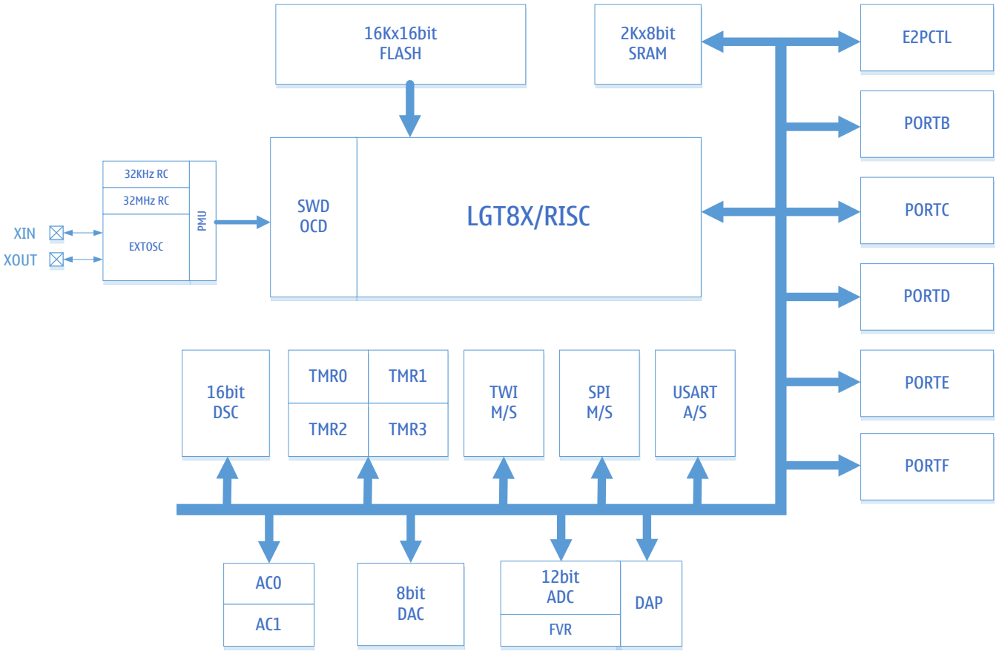

# Описание

LGT8F328P — это 8-битный RISC микроконтроллер, разработанный компанией Logic Green Technologies, аналог микроконтроллера ATmega328P от Microchip (ранее Atmel). 

## Функции
+ Высокопроизводительное 8-битное ядро LGT8XM с низким энергопотреблением
+ Расширенная архитектура RISC
  + 131 инструкция, более 80% выполняются за один такт
  + 32x8 рабочих регистров общего назначения
  + Эффективность выполнения до 32MIPS на частоте 32МГц
  + Внутренний однотактный умножитель (8x8)
+ Память
  + 32 Кбайт встроенной флэш-памяти
  + 2 Кбайт оперативной памяти SRAM
  + Интерфейс E2PROM для программирования встроенной флэш-памяти
  + Шифрование программы для обеспечения безопасности пользовательского кода
+ Периферия
  + Два 8-битных таймера
  + Два 16-битных таймера
  + Внутренний калиброванный RC-генератор 32 кГц
  + Поддерживает до 9 выходов ШИМ, с управлением мертвой зоной
  + 12-канальный 12-битный аналого-цифровой преобразователь (АЦП)
    + Внутреннее или внешнее опорное напряжение
    + Дифференциальный усилитель с программируемым коэффициентом усиления (1/8/16/32)
    + Режим автоматического контроля порогового напряжения
    + Два аналоговых компаратора (AC) для расширения входных каналов АЦП
    + Внутренний калибруемый источник опорного напряжения 1,024В/2,048В/4,096В ±1%
  + 8-битный цифро-аналоговый преобразователь (ЦАП), который можно использовать в качастве источника опорного напряжения
   + Сторожевой таймер (WDT)
   + Синхронный/асинхронный последовательный интерфейс (USART/SPI)
   + Синхронный интерфейс (SPI), режим работы «ведущий/ведомый»
   + Двухпроводной последовательный интерфейс (TWI), совместимый с I2C 
   + 16-разрядный цифровой вычислительный блок ускорения (DSC), поддерживающий прямой 16-разрядный доступ к памяти
+ Специальные функции
    + Двухпроводной интерфейс SWD для программирования и отладки на кристалле
    + Внешние источники прерываний
    + Встроенная схема сброса при включении питания (POR) и программируемая схема обнаружения низкого напряжения питания (LVD)
    + Встроенный RC-генератор 32МГц с точностью калибровки 1%
    + Встроенный RC-генератор 32кГц с точностью калибровки 1%
    + Поддержка внешнего кварцевого резонатора 32,768кГц или 400кГц ~ 32МГц
    + 6x высокоточных двухтактных входов/выходов, поддерживающих высокоскоростные ШИМ
+ Корпус: QFP48L, QFP32L, SSOP20L
+ Напряжение питания: 1,8В ~ 5,5В
+ Минимальное энергопотребление: 1мкА при 3,3В
+ Рабочая частота: 0 ~ 32МГц
+ Температурный диапазон: -40С ~ +85С
+ HBM ESD: > 4 кВ

## Структурная схема

|Название|Описание|
|-|-|
|SWD|Модуль отладки и внутрисхемного программирования|
|LGT8X|8-битное высокопроизводительное RISC-ядро|
|E2PCTL|Контроллер FLASH памяти|
|PMU|Модуль управления энергопотреблением|
|PORTB/C/D/E/F|Универсальные программируемые порты ввода/вывода|
|DSC|16-разрядный цифровой блок ускорения|
|ADC DAP FVR|8-канальный 12-разрядный АЦП c программируемым дифференциальным усилителем. Внутреннее опорное напряжение: 1,024В/2,048В/4,096В|
|AC0/1|Аналоговый компаратор|
|TMR0/1/2/3|8/16-разрядный таймер/счетчик, ШИМ-контроллер|
|WDT|Сторожевой таймер|
|SPI M/S|Ведущий-ведомый SPI-контроллер|
|TWI M/S|Двухпроводной интерфейс, совместимый с протоколом I2C|
|USART|Синхронный/асинхронный последовательный приемопередатчик|
|DAC|8-разрядный цифро-аналоговый преобразователь|

## Корпус

### QFP48L

### QFP32L

### SSOP20

