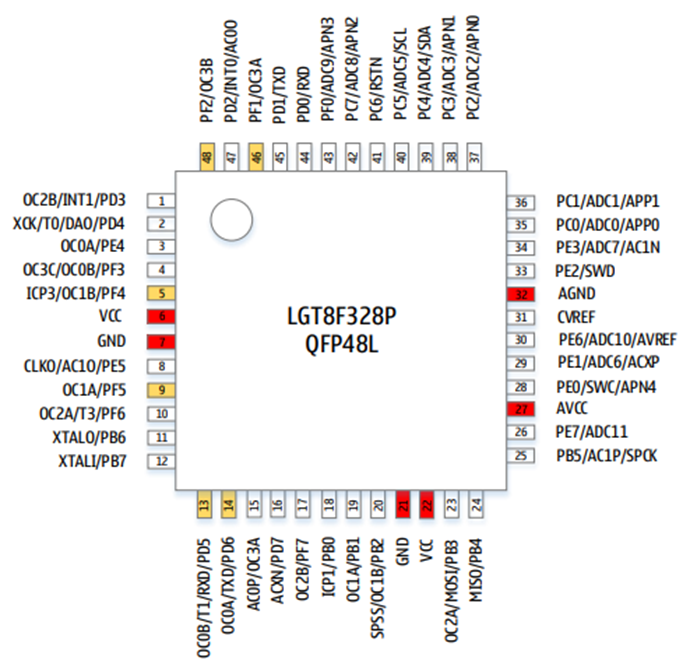

# Описание

LGT8F328P — это 8-битный RISC микроконтроллер, разработанный компанией Logic Green Technologies, аналог микроконтроллера ATmega328P от Microchip (ранее Atmel). 

## Функции
+ Высокопроизводительное 8-битное ядро LGT8FXP с низким энергопотреблением
+ Расширенная архитектура RISC
  + 131 инструкция, более 80% выполняются за один такт
  + 32x8 рабочих регистров общего назначения
  + Эффективность выполнения до 32MIPS на частоте 32МГц
  + Внутренний однотактный умножитель (8x8)
+ Память
  + 32 Кбайт встроенной флэш-памяти
  + 2 Кбайт оперативной памяти SRAM
  + Интерфейс E2PROM для программирования встроенной флэш-памяти
  + Шифрование программы для обеспечения безопасности пользовательского кода
+ Периферия
  + Два 8-битных таймера
  + Два 16-битных таймера
  + Внутренний калиброванный RC-генератор 32 кГц
  + Поддерживает до 9 выходов ШИМ, с управлением мертвой зоной
  + 12-канальный 12-битный аналого-цифровой преобразователь (АЦП)
    + Внутреннее или внешнее опорное напряжение
    + Дифференциальный усилитель с программируемым коэффициентом усиления (1/8/16/32)
    + Режим автоматического контроля порогового напряжения
    + Два аналоговых компаратора (AC) для расширения входных каналов АЦП
    + Внутренний калибруемый источник опорного напряжения 1,024В/2,048В/4,096В ±1%
  + 8-битный цифро-аналоговый преобразователь (ЦАП), который можно использовать в качастве источника опорного напряжения
   + Сторожевой таймер (WDT)
   + Синхронный/асинхронный последовательный интерфейс (USART/SPI)
   + Синхронный интерфейс (SPI), режим работы «ведущий/ведомый»
   + Двухпроводной последовательный интерфейс (TWI), совместимый с I2C 
   + 16-разрядный цифровой вычислительный блок ускорения (DSC), поддерживающий прямой 16-разрядный доступ к памяти
+ Специальные функции
    + Двухпроводной интерфейс SWD для программирования и отладки на кристалле
    + Внешние источники прерываний
    + Встроенная схема сброса при включении питания (POR) и программируемая схема обнаружения низкого напряжения питания (LVD)
    + Встроенный RC-генератор 32МГц с точностью калибровки 1%
    + Встроенный RC-генератор 32кГц с точностью калибровки 1%
    + Поддержка внешнего кварцевого резонатора 32,768кГц или 400кГц ~ 32МГц
    + 6x высокоточных двухтактных входов/выходов, поддерживающих высокоскоростные ШИМ
+ Корпус: QFP48L, QFP32L, SSOP20L
+ Напряжение питания: 1,8В ~ 5,5В
+ Минимальное энергопотребление: 1мкА при 3,3В
+ Рабочая частота: 0 ~ 32МГц
+ Температурный диапазон: -40С ~ +85С
+ HBM ESD: > 4 кВ

## Структурная схема

|Название|Описание|
|-|-|
|SWD|Модуль отладки и внутрисхемного программирования|
|LGT8X|8-битное высокопроизводительное RISC-ядро|
|E2PCTL|Контроллер FLASH памяти|
|PMU|Модуль управления энергопотреблением|
|PORTB/C/D/E/F|Универсальные программируемые порты ввода/вывода|
|DSC|16-разрядный цифровой блок ускорения|
|ADC DAP FVR|8-канальный 12-разрядный АЦП c программируемым дифференциальным усилителем. Внутреннее опорное напряжение: 1,024В/2,048В/4,096В|
|AC0/1|Аналоговый компаратор|
|TMR0/1/2/3|8/16-разрядный таймер/счетчик, ШИМ-контроллер|
|WDT|Сторожевой таймер|
|SPI M/S|Ведущий-ведомый SPI-контроллер|
|TWI M/S|Двухпроводной интерфейс, совместимый с протоколом I2C|
|USART|Синхронный/асинхронный последовательный приемопередатчик|
|DAC|8-разрядный цифро-аналоговый преобразователь|

## Корпус

### QFP48L

### QFP32L

### SSOP20

## Описание выводов
В серии LGT8FX8P все порты доступны только в корпусе QFP48L.
В других корпусах несколько портов ввода-вывода объединяются на одном выводе микросхемы.
При настройке направления вывода микросхемы на это необходимо обратить особое внимание.
В следующей таблице перечислены подключения  портов к выводам микросхемы:

|QFP48|QFP32|SSOP20|Описание|
|:-:|:-:|:-:|:-|
|01|01|03|**PD3/INT1/OC2B** PD3: Порт D3 INT1: Вход внешнего прерывания 1 OC2B: Таймер 2, выход совпадения B|
|02|02|03|**PD4/DAO/T0/XCK** PD4: Порт D4 DAO: Выход ЦАП T0: Таймер 0, вход внешнего тактового сигнала XCK: Линия синхронизации USART|
|03|03|-|**PE4/0C0A** PE4: Порт E4 OC0A: Таймер 0, выход совпадения A|
|04|-|-|**PF3/OC3C/OC0B** PF3: Порт F3 OC3C: Таймер 3, выход совпадения C OC0B: Таймер 0, выход совпадения B|
|05|03|03|**PF4/OC1B/ICP3** PF4: Порт F4 OC1B: Таймер 1, выход совпадения B ICP3: Таймер 3, вход захвата|
|06|04|04|**VCC** Питание|
|07|05|05|**GND** Общий|
|08|06|-|**PE5/AC1O/CLKO** PE5: Порт E5 AC1O: Выход аналогового компаратора 1 CLKO: Выход тактовой частоты|
|09|06|06|**PF5/OC1A** PF5: Порт F5 OC1A: Таймер 1, выход совпадения A|
|10|-|-|**PF6/T3/OC2A** PF6: Порт F6 T3: Таймер 3, внешний тактовый вход OC2A: Таймер 2, выход совпадения A|
|11|07|06|**PB6/XTALO** PB6: Порт B6 XTALO: Выход кварцевого генератора|
|12|08|07|**PB7/XTALI** PB7: Порт B7 XTALI: Вход кварцевого генератора|
|13|09|08|**PD5/RXD/T1/OC0B** PD5: Порт D5 RXD: Вход приема данных USART T1: Таймер 1, вход внешнего тактового сигнала 1 OC0B: Таймер 0 выход совпадения B|
|14|10|09|**PD6/TXD/OC0A** PD6: Порт D6 TXD: Выход передачи данных USART OC0A: Таймер 0, выход совпадения A|
|15|10|09|**AC0P/0C3A** AC0P: Аналоговый компаратор 0, положительный вход OC3A: Таймер 3, выход совпадения A|
|16|11|10|**PD7/ACXN** PD7: Порт D7 ACXN: Аналоговый компаратор 0/1, общий инверсный вход|
|17|-|10|**PF7/OC2B** PF7: Порт F7 OC2B: Таймер 2, выход совпадения B|
|18|12|11|**PB0/ICP1** PB0: Порт B0 ICP1: Таймер 1, вход захвата|
|19|13|11|**PB1/OC1A** PB1: Порт B1 OC1A: Таймер 1, выход совпадения A|
|20|14|12|**PB2/OC1B/SPSS** PB2: Порт B2 OC1B: Таймер 1, выход совпадения B SPSS: Выбор микросхемы в режиме ведомого SPI|
|21|-|-|**GND** Общий|
|22|-|-|**VCC** Питание|
|23|15|12|**PB3/MOSI/OC2A** PB3: Порт B3 MOSI: SPI выход/вход в режиме ведущего/ведомого OC2A: Таймер 2, выход совпадения A|
|24|16|13|**PB4/MISO** PB4: Порт B4 MISO: SPI вход/выход в режиме ведущего/ведомого|
|25|17|14|**PB5/SPCK/AC1P** PB5: Порт B5 SPCK: SPI сигнал синхронизации AC1P: Аналоговый компаратор 1, положительный вход|
|26|-|-|**PE7/ADC11** PE7: Порт E7 ADC11: АЦП, аналоговый вход 11 
|27|-|-|**AVCC** AVCC: Аналоговое питание|
|28|18|15|**PE0/SWC/APN4** PE0: Порт E0 SWC: Линия синхронизации модуля SWD APN4: Отрицательный вход дифференциального усилителя 4|
|29|19|15|**PE1/ADC6/ACXP** PE1: Порт E1 ADC6: АЦП, аналоговый вход 6 ACXP: Аналоговый компаратор 0/1 общий положительный вход|
|30|20|16|**PE6/ADC10/AVREF** PE6: Порт E6 ADC10: АЦП, аналоговый вход 10 AVREF: Вход внешнего опорного напряжения АЦП|
|31|-|-|**CVREF** CVREF: Выход опорного напряжения АЦП, используется только для внешнего фильтрующего конденсатора емкостью 0,1 мкФ|
|32|-|-|**AGND** AGND: Общий аналоговый|
|33|21|16|**PE2/SWD** PE2: Порт E2 Линия данных модуля SWD|
|34|22|16|**PE3/ADC7/AC1N** PE3: Порт E3 ADC7: АЦП, аналоговый вход 7 AC1N: Аналоговый компаратор 1, отрицательный вход|
|35|23|17|**PC0/ADC0/APP0** PC0: Порт C0 ADC0: АЦП, аналоговый вход 0 APP0: Положительный вход дифференциального усилителя 0|
|36|24|18|**PC1/ADC1/APP1** PC1: Порт C1 ADC1: АЦП, аналоговый вход 1 APP1: Положительный вход дифференциального усилителя 1|
|37|25|-|**PC2/ADC2/APN0** PC2: Порт C2 ADC2: АЦП, аналоговый вход 2 APN0: Отрицательный вход дифференциального усилителя 0|
|38|26|-|**PC3/ADC3/APN1** PC3: Порт C3 ADC3: АЦП, аналоговый вход 3 APN1: Отрицательный вход дифференциального усилителя 1|
|39|27|19|**PC4/ADC4/SDA** PC4: Порт C4 ADC4: АЦП, аналоговый вход 4 SDA: Линия данных I2C|
|40|28|20|**PC5/ADC5/SCL** PC5: Порт C5 ADC5: АЦП, аналоговый вход 5 SCL: Линия синхронизации I2C|
|41|29|1|**PC6/RESETN** PC6: Порт C6 RESETN: Вход внешнего сброса|
|42|-|-|**PC7/ADC8/APN2** PC7: Порт C7 ADC8: АЦП, аналоговый вход 8 APN2: Отрицательный вход дифференциального усилителя 2|
|43|-|-|**PF0/ADC9/APN3** PF0: Порт F0 ADC9: АЦП, аналоговый вход 9 APN3: Отрицательный вход дифференциального усилителя 3|
|44|30|-|**PD0/RXD** PD0: Порт D0 RXD: Вход приема данных USART|
|45|31|-|**PD1/TXD** PD1: Порт D1 TXD: Выход передачи данных USART|
|46|31|1|**PF1/OC3A** PF1: Порт F1 OC3A: Таймер 3, выход совпадения A|
|47|32|2|**PD2/INT0/AC0O** PD2: Порт D2 INT0: Вход внешнего прерывания 0 AC0O: Аналоговый компаратор 0, выход|
|48|32|2|**PF2/OC3B** PF2: Порт F2 OC3B: Таймер 3, выход совпадения B|
