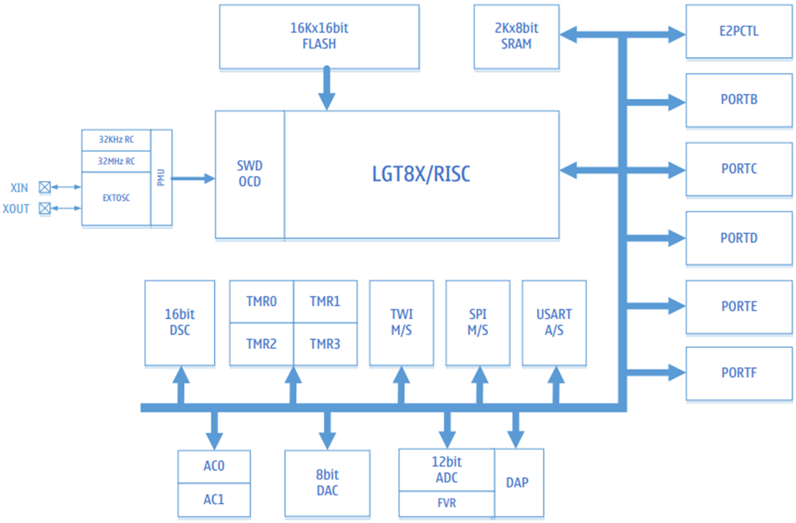

# Структурная схема

|Название|Описание|
|-|-|
|SWD|Модуль отладки и внутрисхемного программирования|
|LGT8X|8-битное высокопроизводительное RISC-ядро|
|E2PCTL|Контроллер FLASH памяти|
|PMU|Модуль управления энергопотреблением|
|PORTB/C/D/E/F|Универсальные программируемые порты ввода/вывода|
|DSC|16-разрядный цифровой блок ускорения|
|ADC DAP FVR|8-канальный 12-разрядный АЦП c программируемым дифференциальным усилителем. Внутреннее опорное напряжение: 1,024В/2,048В/4,096В|
|AC0/1|Аналоговый компаратор|
|TMR0/1/2/3|8/16-разрядный таймер/счетчик, ШИМ-контроллер|
|WDT|Сторожевой таймер|
|SPI M/S|Ведущий-ведомый SPI-контроллер|
|TWI M/S|Двухпроводной интерфейс, совместимый с протоколом I2C|
|USART|Синхронный/асинхронный последовательный приемопередатчик|
|DAC|8-разрядный цифро-аналоговый преобразователь|
