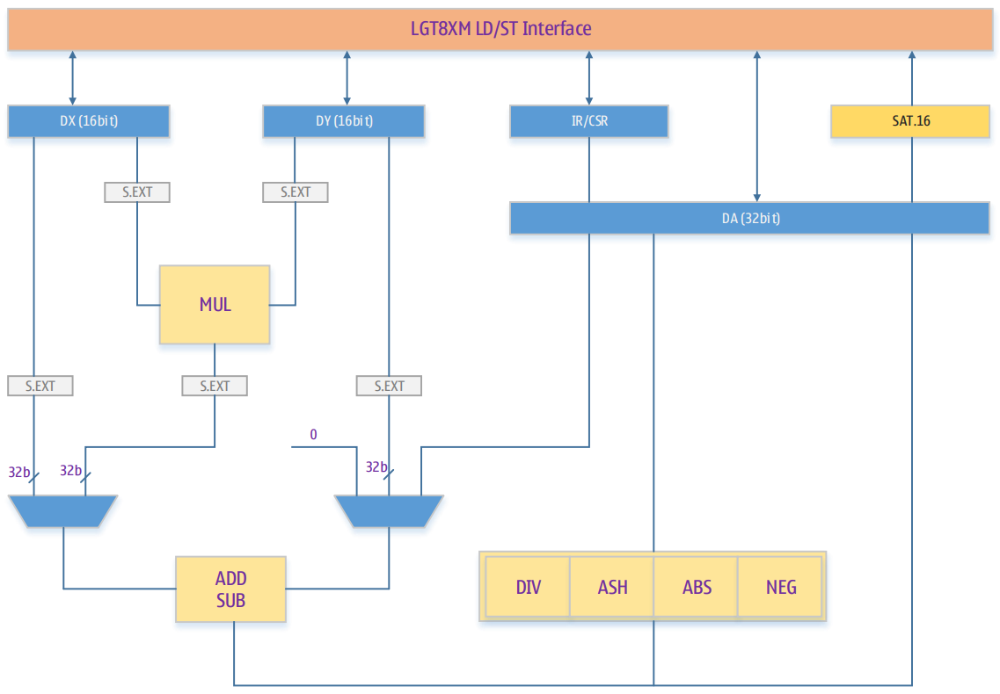
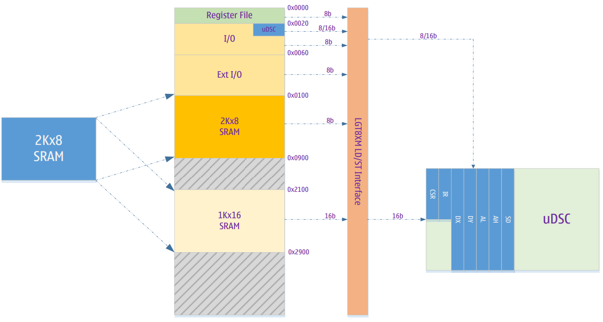
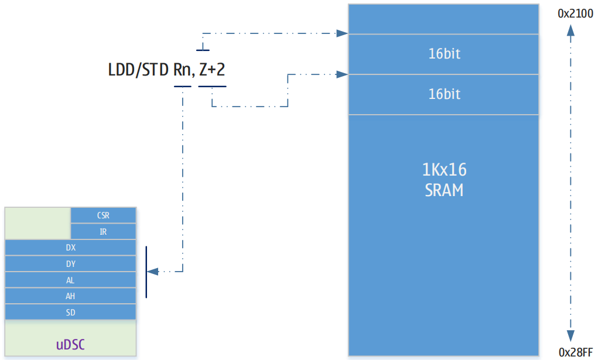

# Ускоритель вычислений (uDSC)

- 16-битный режим хранения (LD/ST)
- 32-битный аккумулятор (DX)
- Однотактный 16-битный умножитель (MUL)
- 32-битное арифметико-логическое устройство (ALU)
- 16-битная насыщенная арифметика (SD)
- 8-тактный 32/16-битный делитель
- Однотактные операции умножения-сложения/умножения-вычитания (MAC/MSC)

## Обзор
Цифровой ускоритель вычислений (uDSC) является вычислительным сопроцессорным модулем ядра LGT8XP, который работает в сочетании с 16-битным режимом LD/ST ядра LGT8XP, реализуя 16-битный блок цифровой обработки сигналов. Это позволяет удовлетворять требованиям большинства задач обработки цифровых сигналов в управляющих системах.

Функции uDSC и его внутренняя структура:
- 16-битные регистры операндов DX/DY
- 32-битный аккумуляторный регистр DA
- Однотактный 17-битный умножитель (способен выполнять 16-битные умножения как для знаковых, так и для беззнаковых чисел)
- 32-битное ALU (способно выполнять 16/32-битные операции сложения, вычитания и сдвига)
- 16-битная насыщенная арифметика (используется для сохранения результатов вычислений в RAM)
- 32/16-битный делитель, завершающий операции за 8 тактов.



## 16-битный режим работы LD/ST
Для повышения эффективности обработки больших объемов данных в uDSC, ядро LGT8XM реализует специальный 16-битный канал LD/ST, который позволяет использовать инструкции LDD/STD для эффективного обмена 16-битными данными между uDSC, SRAM и регистрами общего назначения.

Чтобы не нарушать работу стандартной системы инструкций LD/ST, ядро LGT8XM переназначает пространство SRAM на адреса 0x2100–0x28FF. Когда инструкции LD/ST используются для доступа к SRAM в этом диапазоне адресов, ядро автоматически активирует 16-битный режим LD/ST, открывая прямой канал доступа между SRAM и uDSC.

На следующем рисунке показано распределение адресного пространства данных в ядре LGT8XM:



Как показано на рисунке выше, ядро LGT8XM может использовать инструкции LD/ST для прямого 16-битного доступа к данным между регистрами DX/DY/DA uDSC и SRAM. Внутренние регистры uDSC также отображаются в пространство I/O, и доступ к ним может осуществляться в двух режимах: 8-битном и 16-битном.

Помимо регистров DX/DY/DA, используемых для вычислений, uDSC также включает два дополнительных 8-битных регистра:
- Регистр управления и состояния (CSR)
- Регистр команд (IR)

Доступ к CSR и IR возможен только через пространство I/O побайтово, тогда как доступ к DX/DY/AL/AH осуществляется в 16-битном режиме. Для доступа к этим регистрам можно использовать инструкции IN/OUT, LD/ST, LDD/STD, LDS/STD и другие.

Все управляющие, статусные и регистры данных uDSC отображаются в пространство I/O, что позволяет выполнять 8/16-битный доступ за один такт с помощью инструкций IN/OUT.

CSR используется для управления режимами работы uDSC и хранения флагов состояния текущих операций. IR управляет конкретными операциями, выполняемыми uDSC. Большинство операций 

uDSC выполняются за один такт, за исключением деления, которое требует 7 тактов ожидания. Завершение операции деления можно проверить с помощью флагов в регистре CSR.

Стандартные инструкции LD/ST используют внутренние регистры общего назначения LGT8XM в качестве данных для LD/ST, а регистры X/Y/Z — в качестве целевых адресов. Когда целевой адрес попадает в 16-битное отображение SRAM, значение операндов инструкций LD/ST изменяется: X/Y/Z по-прежнему используются как целевые адреса, а значение регистров общего назначения интерпретируется в зависимости от режима отображения uDSC. Режим отображения uDSC применяется только для доступа к адресам 0x2100–0x28FF и устанавливается с помощью 6-го бита (MM) регистра CSR.

В 16-битном режиме LD/ST инструкция "LDD Rn, Z+q" означает загрузку 16-битных данных по адресу [Z] в регистр данных uDSC, после чего значение Z увеличивается на смещение "q". Значение Rn в этой инструкции зависит от режима отображения CSR[MM], как показано ниже:

### Инструкция: LDD Rn, Z+q
|CSR[MM]|[Z+q]|Опкод|Операции|
|-|-|-|-|
|0|0x2100-0x28FF|LDD R0, Z+q<br>LDD R1, Z+q<br>LDD R2, Z+q<br>LDD R3, Z+q|DX = [Z]; Z = Z + q; R0 остается неизменным<br>DY = [Z]; Z = Z + q; R1 остается неизменным<br>AL = [Z]; Z = Z + q; R2 остается неизменным<br>AH = [Z]; Z = Z + q; R3 остается неизменным|
|1|0x2100-0x28FF|LDD Rn, Z+q|{Rn} адрес для DX/DY/AL/AH в области I/O<br>[DX/DY/AL/AV] = [Z]; Z = Z + q<br>Rn остается неизменным|


### Инструкция: STD Rn, Z/V+q
|CSR[MM]|[Z+q]|Опкод|Операции|
|-|-|-|-|
|0|0x2100-0x28FF|STD Z+q R0<br>STD Z+q, R1<br>STD Z+q, R2<br>STD Z+q, R3<br>STD Z+q, R4|[Z] = DX; Z = Z + q; R0 остается неизменным<br>[Z] = DY; Z = Z + q; R1 остается неизменным<br>[Z] = AL; Z = Z + q; R2 остается неизменным<br>[Z] = AH; Z = Z + q; R3 остается неизменным<br>[Z] = SD; Z = Z + q; R4 остается неизменным|
|1|0x2100-0x28FF|STD Z+q, Rn|{Rn} адрес для DX/DY/AL/AH/SD в области I/O<br>[Z] = [DX/DY/AL/AH/SD] адресован к {Rn}<br>Rn остается неизменным

Инструкции LD/ST и LDS/STS в наборе инструкций LGT8XM также могут обращаться к области 0x2100–0x28FF, но адресация Y/Z+q в инструкциях LDD/STD более эффективна. Адресация LDD/STD основана на базовом адресе, где Y/Z может быть установлен как базовый адрес данных в RAM. Используя адресацию Y/Z+q в инструкциях LDD/STD, можно выполнить инструкцию и получить доступ к данным за один такт, автоматически перемещая указатель адреса на следующий целевой адрес.

В стандартном режиме адресации Y/Z+q в инструкциях LDD/STD ядра LGT8XM, при выполнении инструкции используется адрес [Y/Z+q] для 8-битных данных, и значение Y/Z не увеличивается после выполнения. Однако при использовании LDD/STD для адресации в диапазоне 0x2100–0x28FF, поведение инструкции изменяется: используется адрес [Y/Z] для 16-битных данных, и после выполнения значение Y/Z увеличивается на смещение "q". Это повышает эффективность последовательной адресации, особенно при q=2, что позволяет адресовать последовательные 16-битные данные.



### Отображение адресов переменных на 16-битный режим адресации

LGT8XM является 8-битным процессором, и доступ к данным осуществляется побайтово. Микроконтроллер LGT8F328P имеет встроенное 2 КБ пространство данных, которое отображается на адреса 0x0100–0x08FF. Компиляторы C/C++ автоматически распределяют переменные в этом диапазоне адресов. Если в C/C++ определен 16-битный массив, который необходимо обработать с помощью uDSC, сначала нужно отобразить адрес этой переменной в область 16-битного доступа LD/ST (0x2100–0x28FF). Это делается простым добавлением смещения 0x2000 к адресу переменной.

## Определение инструкций для операций uDSC

Программное обеспечение задает операции, которые должны быть выполнены, через регистр IR uDSC. Все операции uDSC выполняются между регистрами DX/DY/DA. Пользователь может использовать 16-битный канал LD/ST для быстрого обмена данными между DX/DY/DA и SRAM.

|Операция|IR7|IR6|IR5|IR4|IR3|IR2|IR1|IR0|Функция|
|-|-|-|-|-|-|-|-|-|-|
|**ADD/SUB**|
||0|0|S<sup>1</sup>|0|0|1|0|1|DA = DX + DY|
||0|0|S<sup>1</sup>|0|0|0|0|1|DA = DX – DY|
||0|0|0|1|1|1|0|1|DA = DY|
||0|0|S<sup>1</sup>|1|1|0|0|1|DA = -DY|
||0|0|S<sup>1</sup>|1|0|1|1|1|DA = DA + DY|
||0|0|S<sup>1</sup>|1|0|0|1|1|DA = DA – DY|
|**MAC/MSC**|
||0|1|S1<sup>2</sup>|S0<sup>2</sup>|0|1|0|0|DA = DX * DY|
||0|1|S1<sup>2</sup>|S0<sup>2</sup>|0|0|0|0|DA = -DX * DY|
||0|1|S1<sup>2</sup>|S0<sup>2</sup>|1|1|0|0|DA = (DX * DY) >> 1|
||0|1|S1<sup>2</sup>|S0<sup>2</sup>|1|0|0|0|DA = (-DX * DY) >> 1|
||0|1|S1<sup>2</sup>|S0<sup>2</sup>|0|1|1|S|DA = DA + DX * DY|
||0|1|S1<sup>2</sup>|S0<sup>2</sup>|1|1|1|S|DA = (DA + DX * DY) >> 1|
||0|1|S1<sup>2</sup>|S0<sup>2</sup>|0|0|1|S|DA = DA – DX * DY|
||0|1|S1<sup>2</sup>|S0<sup>2</sup>|1|0|1|S|DA = (DA – DX * DY) >> 1|
|**MISC**|
||1|0|0|0|0|0|0|0|DA = 0|
||1|0|0|0|0|1|0|S|DA = NEG(DA)|
||1|0|0|0|1|0|0|S|DA = DX^2|
||1|0|0|0|1|0|1|S|DA = DY^2|
||1|0|1|0|0|0|0|S|DA = ABS(DA)|
||1|0|1|1|0|0|0|0|DA = DA/DY|
||1|0|1|1|0|0|0|1|DA = DA/DY, DY = DA%DY|
|**SHIFT**|
||1|1|0|0|N3|N2|N1|N0|DA = DA << N|
||1|1|S|1|N3|N2|N1|N0|DA = DA >> N|

Примечание:
1. S указывает, является ли операция знаковой или беззнаковой.
2. S1 указывает, является ли DX числом со знаком, а S2 указывает, является ли DY числом со знаком.
3. N[3:0] — количество четырехбитных сдвигов, которое может достигать максимум 15-битных операций сдвига.

## Регистры uDSC
|Имя|Адрес|Описание|
|-|-|-|
|DCSR|0x20 (0x00)|Регистр состояния управления uDSC|
|DSIR|0x21 (0x01)|Регистр инструкции|
|DSSD|0x22 (0x02)|16-разрядное переполнение 32-разрядного аккумулятора DSA|
|DSDX|0x10 (0x30)|Операнд DSDX, 16-битный доступ для чтения и записи|
|DSDY|0x11 (0x31)|Операнд DSDY, 16-битный доступ для чтения и записи|
|DSAL|0x38 (0x58)|32-битный аккумулятор DSA[15:0], 16-битный доступ для чтения и записи|
|DSAH|0x39 (0x59)|32-битный аккумулятор DSA[31:16], 16-битный доступ для чтения и записи|

### Регистр управления DSCR

|Имя|Адрес|Значение по умолчанию|
|-|-|-|
|DCSR|0x20(0x00)|0010xxxx|

|Бит|Доступ|Имя|Описание|
|-|-|-|-|
|7|R/W|DSUEN|uDSC модуль включить управление; 1 = включить, 0 = отключить|
|6|R/W|ММ|Режим отображения регистров uDSC, подробное описание см.<br>во введении к 16-битному рабочему режиму.<br>0 = Режим быстрого доступа, 1 = Режим сопоставления ввода-вывода|
|5|R/W|D1|Флаг завершения операции деления, 1 = завершена|
|4|R/W|D0|Операция деления, флаг деления на 0 |
|3|-|-|Не реализовано|
|2|R/W|N|Результат операции отрицательное число|
|1|R/W|Z|Результат операции — ноль|
|0|R/W|C|Флаг переноса/заимствования сумматора|

### Регистр инструкции DSIR

|Имя|Адрес|Значение по умолчанию|
|-|-|-|
|DSIR|0x21 (0x01)|0x00|

|Бит|Доступ|Имя|Описание|
|-|-|-|-|
|7:0|R/W|IR|инструкция, обратитесь к описанию раздела.|

### Регистр операнда DSDX

|Имя|Адрес|Значение по умолчанию|
|-|-|-|
|DSDX|0x30 (0x10)|0x00|

|Бит|Доступ|Имя|Описание|
|-|-|-|-|
|15:0|R/W|DSDX|16-битный операнд|

### Регистр операнда DSDY

|Имя|Адрес|Значение по умолчанию|
|-|-|-|
|DSDY|0x31 (0x11)|0x00|

|Бит|Доступ|Имя|Описание|
|-|-|-|-|
|15:0|R/W|DSDY|16-битный операнд|

### Регистр результата операции DSAL

|Имя|Адрес|Значение по умолчанию|
|-|-|-|
|DSAL|0x58 (0x38)|0x00|

|Бит|Доступ|Имя|Описание|
|-|-|-|-|
|15:0|R/W|DSAL|младшие 16 бит 32-битного аккумулятора DA|

### Регистр результата операции DSAH

|Имя|Адрес|Значение по умолчанию|
|-|-|-|
|DSAH|0x59 (0x39)|0x00|

|Бит|Доступ|Имя|Описание|
|-|-|-|-|
|15:0|R/W|DSAH|старшие 16 бит 32-битного аккумулятора DA|

### Регистр переполнения DSSD

|Имя|Адрес|Значение по умолчанию|
|-|-|-|
|DSSD|0x22 (0x02)|0x00|

|Бит|Доступ|Имя|Описание|
|-|-|-|-|
|15:0|R/W|DSSD|16-разрядное переполнение 32-разрядного аккумулятора DSA|

## Примеры применения uDSC
Пример конфигурации и использования, простая подпрограмма (AVRGCC), которая реализует 16-битную операцию умножения и возвращает 32-битный результат:
```
unsigned long dsu_xmuluu(unsigned short dy, unsigned short dx);
```
Ниже приведен код реализации ассемблерной функции C:
```
#include “udsc_def.inc”     ; opcode definitions
.global dsu_xmuluu          ; declare for called from C/C++ code

dsu_xmuluu:
out DSDX, r24               ; load DX
out DSDY, r22               ; load DY
ldi r20, XMULUU             ; load opcode
out DSIR, r20               ; do multiply
in r22, DSAL                ; {r23, r22} = AL
in r24, DSAH                ; {r25, r24} = AH
ret
```